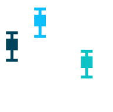

pulsar_spectra
======

 

A simple interface to record pulsar's flux density measurements for a large number of papers and perform fitting of spectral models.

Installation
=====
You can install via pip using
`pip install pulsar_spectra` (stable)

Or you can clone or download the repository and then use `python setup.py install` or `pip install .`

Documentation
=====
Some basic documentation can be found [here](https://pulsar-spectra.readthedocs.io/en/latest/)

Catalogue data
=====
The catalogue comprises YAML files containing pulsar flux density measurements for each paper the repository has included.
You should not assume that this repository has all flux density measurements for a pulsar you are interested in.
Instead, you should search through the literature to find all papers that contain flux density measurements of
the pulsar and confirm all of those papers are in the catalogue. You can find a list of the papers in the catalogue [here](https://pulsar-spectra.readthedocs.io/en/latest/catalogue.html#papers-included-in-our-catalgoue)

If you would like to add a new paper to the catalogue read [the guide](https://pulsar-spectra.readthedocs.io/en/latest/catalogue.html#adding-papers)

Status
=====
