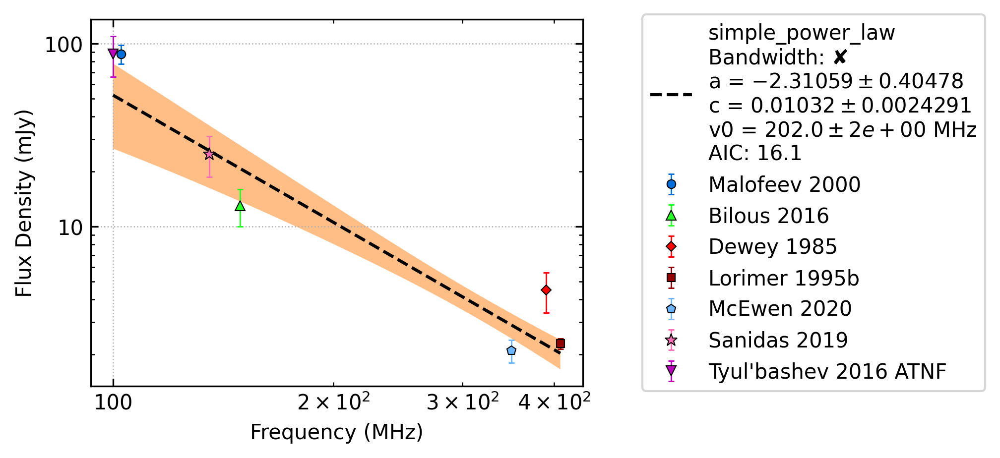
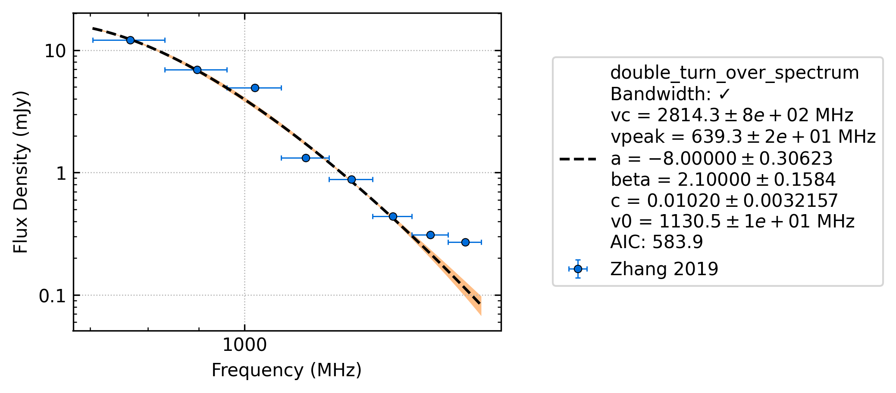

Bandwidth Intergration
======================

Pulsar spectral fitting often assumes that the reported average flux densities are currently treated as
the flux density at one specific (usually central) frequency, whereas in reality, they are averaged over some finite bandwidth.
This assumption becomes increasingly inaccurate for wider fractional bandwidths.
For this reason we have expanded the catalogue's database to include the bandwidth of all detections and
expanded our equations to model the integrated flux density across the band.

When the bandwidth integration is used
---------------------------------------
The software first tries to fit the spectrum with the simple models (the models without the bandwidth integration)
then uses their fit results and intial parameters in the bandwidth integration model fit.
If the simple model fails to converge, the bandwidth integration model is not attempted.
If any of the data has `None` as their bandwidth, the bandwidth integration models cannot be used.
This is most common when there is ANTF data in the fit (which you can replace :ref:`like so <adding_papers>`).

You can see that the bandwidth integration model was used or not based on the tick or cross on the plot label.
Here is an example of J0048+3412 which could not be fit with the band integration model due to the ATNF data:

.. _display_band:

Displaying the bandwidth
------------------------
In the pulsar_spectra plots, the x error bars do not display an uncertainty.
We use the x error bars to display the bandwidth of each flux density measurement.
The following is an example of J0024-7204J which Zhang et al. (2019) split into
many frequency subintegrations:

You can see how the bandwidth of each flux density measurement is now clearly displayed.

.. _derivations:

Derivations
-----------
If a flux density measurement is reported along with a bandwidth, then the correct way to fit models is to find the expected mean flux density across the band for each model,

.. math::

    S_\rm{avg} = \frac{1}{\rm{BW}} \int_{\nu_\text{min}}^{\nu_\text{min}} S_\nu\,\text{d}\nu,

where :math:`\rm{BW} = \nu_\text{min} - \nu_\text{min}`.
The evaluation of this expression for each of the models currently implemented in pulsar_spectra follows.
Derivations for the log-parabolic are also included, although this model is deactivated in pulsar_spectra by default.

How to use sympy to help with derivations
~~~~~~~~~~~~~~~~~~~~~~~~~~~~~~~~~~~~~~~~~
`Sympy <https://docs.sympy.org/latest/index.html>`_ is an excellent tool for performing differentation and simple intergration. An example is given below:

.. code::

    v, vpeak, a, c, beta, v0 = symbols('v vpeak \alpha c beta v0')
    f = c * (v/v0)^a * exp( \alpha / beta * (v/vpeak)^(-beta) )
    f2 = f.diff(v).diff(v).simplify()

This will output the second derivative of the specified function:

.. code::

    a*c*(v/v0)^a*(v/vpeak)^(-2*(a + (v/vpeak)^(2*(a - 1) + (v/vpeak)^beta*(-2*a + beta + 1))*exp(a*(v/vpeak)^(-beta)/beta)/v^2

Integration of the model functions
----------------------------------
In the following subsections, bandwidth integrations are performed directly using the model functions which are detailed in Swainston et al. (2022).

Simple power law
~~~~~~~~~~~~~~~~
The simple power law model is

.. math::

    S_\nu = c \left( \frac{\nu}{\nu_0} \right)^\alpha,

where :math:`\nu_0` is the reference frequency, :math:`\alpha` is the spectral index, and :math:`c` is a constant.
The bandwidth integration for this model is relatively simple, as shown below:

.. math::

    S_\text{avg} &= \frac{1}{\rm{BW}} \int_{\nu_\text{min}}^{\nu_\text{max}} c \left( \frac{\nu}{\nu_0} \right)^\alpha \,\text{d}\nu, \\
    &= \frac{\nu_0}{\rm{BW}} \left[\frac{c}{\alpha+1} \left(\frac{\nu}{\nu_0}\right)^{\alpha + 1}  \right]_{\nu_\text{min}}^{\nu_\text{max}} \\
    &= \frac{\nu_0}{\rm{BW}} \frac{c}{\alpha+1} \left[ \left(\frac{{\nu_\text{max}}}{\nu_0}\right)^{\alpha + 1} - \left(\frac{{\nu_\text{min}}}{\nu_0}\right)^{\alpha + 1} \right] \\
    &= \frac{c({\nu_\text{max}}^{\alpha+1} - {\nu_\text{min}}^{\alpha+1})}{\rm{BW}\,\nu_0^\alpha(\alpha+1)}.

.. _broken_power_law_intergral:

Broken power law
~~~~~~~~~~~~~~~~

The broken power law model is two connected power laws with spectral indices :math:`\nu_1` and :math:`nu_2`
and a break frequency :math:`\nu_b`,

.. math::

    S_\nu &= c\begin{cases}
            \left( \frac{\nu}{\nu_0} \right)^{\alpha_1}   & \mathrm{if}\: \nu \leq {\nu_b} \\[5pt]
            \left( \frac{\nu}{\nu_0} \right)^{\alpha_2} \left( \frac{{\nu_b}}{\nu_0} \right)^{\alpha_1-\alpha_2} & \mathrm{otherwise} \\
        \end{cases}.

If :math:`{\nu_\text{min}} < {\nu_\text{max}} \le{\nu_b}`, then :math:`S_\text{avg}` is identical to the simple power law with the substitution :math:`\alpha \leftarrow \alpha_1` :

.. math::

    S_\text{avg} = \frac{c({\nu_\text{max}}^{\alpha_1+1} - {\nu_\text{min}}^{\alpha_1+1})}{\rm{BW}\,\nu_0^{\alpha_1}(\alpha_1+1)}.

If both :math:`{\nu_b} \le {\nu_\text{min}} < {\nu_\text{max}}`, then the subtitution :math:`\alpha \leftarrow \alpha_2` is performed,
and an additional factor is introduced to match the power law with the break frequency:

.. math::

    S_\text{avg} = \frac{c({\nu_\text{max}}^{\alpha_2+1} - {\nu_\text{min}}^{\alpha_2+1})}{\rm{BW}\,\nu_0^{\alpha_2}(\alpha_2+1)} \left( \frac{{\nu_b}}{\nu_0} \right)^{\alpha_1-\alpha_2}.

In the final case, when :math:`{\nu_\text{min}} < {\nu_b} < {\nu_\text{max}}`, the solution is a combination of the above:

.. math::

    S_\text{avg} = \frac{c({\nu_b}^{\alpha_1+1} - {\nu_\text{min}}^{\alpha_1+1})}{({\nu_b} - {\nu_\text{min}})\,\nu_0^{\alpha_1}(\alpha_1+1)} + \frac{c({\nu_\text{max}}^{\alpha_2+1} - {\nu_b}^{\alpha_2+1})}{({\nu_\text{max}} - {\nu_b})\,\nu_0^{\alpha_2}(\alpha_2+1)} \left( \frac{{\nu_b}}{\nu_0} \right)^{\alpha_1-\alpha_2},

where the factors :math:`(\nu_b-\nu_\rm{min})^{-1}` and :math:`(\nu_\rm{max}-\nu_b)^{-1}` replace the :math:`\rm{BW}^{-1}` in normalising the integrated flux density.

Log-parabolic spectrum
~~~~~~~~~~~~~~~~~~~~~~
The log-parabolic spectrum is a parabola in log-space, with the form:

.. math::

    \log_{10} S_\nu
        = a \left [ \log_{10} \left ( \frac{\nu}{\nu_0} \right ) \right]^2 + b \, \log_{10} \left ( \frac{\nu}{\nu_0} \right ) + c,

where :math:`a` is the curvature parameter, :math:`b` is the spectral index for :math:`a=0`, and :math:`c` is a constant.
This model can be re-expressed to be linear in :math:`S_\nu` as

.. math::

    S_\nu &= 10^{a  \left [ \log_{10} \left ( \frac{\nu}{\nu_0} \right ) \right]^2 + b \, \log_{10} \left ( \frac{\nu}{\nu_0} \right ) + c} \\
    &= e^{\ln 10 \left(a  \left [ \log_{10} \left ( \frac{\nu}{\nu_0} \right ) \right]^2 + b \, \log_{10} \left ( \frac{\nu}{\nu_0} \right ) + c\right)} \\
    &= Ce^{\ln 10 \left(a  \left [ \log_{10} \left ( \frac{\nu}{\nu_0} \right ) \right]^2 + b \, \log_{10} \left ( \frac{\nu}{\nu_0} \right )\right)},

where :math:`C = e^{c\ln 10} = 10^c`. The :math:`\log_{10}` terms can be expressed in terms of the natural logarithm as

.. math::

    S_\nu &= Ce^{\ln 10 \left(a  \left [ \frac{\ln\left ( \frac{\nu}{\nu_0} \right )}{\ln 10} \right]^2 + b \, \frac{\ln \left ( \frac{\nu}{\nu_0} \right )}{\ln 10}\right)} \\
    &= Ce^{\left(\frac{a}{\ln 10}  \left [ \ln\left ( \frac{\nu}{\nu_0} \right )\right]^2 + b \, \ln \left ( \frac{\nu}{\nu_0} \right )\right)}.

In this form, the integration becomes slightly easier. WolframAlpha then returns the generic solution

.. math::

    \int e^{A(\ln x)^2 + B\ln x}\,\text{d}x
        = \frac{\sqrt{\pi} e^{-\frac{(B+1)^2}{4A}} \text{erfi} \left(\frac{2A\ln x + B + 1}{2\sqrt{A}}\right)}{2\sqrt{A}}.

In our case, this works out to

.. math::

    S_\text{avg} &=
        \frac{1}{\rm{BW}}\int_{\nu_\text{min}}^{\nu_\text{max}} Ce^{\left(\frac{a}{\ln 10}  \left [ \ln\left ( \frac{\nu}{\nu_0} \right )\right]^2 + b \, \ln \left ( \frac{\nu}{\nu_0} \right )\right)}\,\text{d}\nu \\
        &= \frac{C\nu_0}{2\rm{BW}} \sqrt{\frac{\pi \ln 10}{a}} \, 10^{-\frac{(b+1)^2}{4a}} \left[\text{erfi} \left(\frac{2a\ln \left(\frac{\nu}{\nu_0}\right) + b + 1}{2\sqrt{a\ln 10}}\right)\right]_{\nu_\text{min}}^{\nu_\text{max}}.

.. _high_frequency_cut_off_power_law_intergral:

High-frequency cut-off power law
~~~~~~~~~~~~~~~~~~~~~~~~~~~~~~~~
This model is a power law spectrum with a high-frequency cut-off occurring at the cut-off frequency :math:`\nu_c` :

.. math::

    S_\nu = c\left( \frac{\nu}{\nu_0} \right)^{\alpha} \left ( 1 - \frac{\nu}{\nu_c} \right ),\qquad \nu < \nu_c.

The bandwidth integration is performed as follows:

.. math::

    S_\text{avg} &= \frac{1}{\rm{BW}} \int_{\nu_\text{min}}^{\nu_\text{max}} c\left( \frac{\nu}{\nu_0} \right)^{\alpha} \left ( 1 - \frac{\nu}{\nu_c} \right ) \,\text{d}\nu \\
    &= -\frac{c}{\rm{BW} \nu_0^\alpha} \left[ \frac{\nu^{\alpha + 1}}{\alpha + 1} + \frac{\nu^{\alpha + 2}}{\nu_c (\alpha + 2)}\right]_{\nu_\text{min}}^{\nu_\text{max}} \\
    &= -\frac{c}{\rm{BW} \nu_0^\alpha} \left( \frac{{\nu_\text{max}}^{\alpha + 1} - {\nu_\text{min}}^{\alpha + 1}}{\alpha + 1} + \frac{{\nu_\text{max}}^{\alpha + 2} - {\nu_\text{min}}^{\alpha + 2}}{\nu_c (\alpha + 2)}\right ).

sympy provides the solution:

.. code::

    Piecewise((-c*v0**2*(v*log(v) + vc)/(v*vc), Eq(a, -2)), (c*v0*(-v + vc*log(v))/vc, Eq(a, -1)), (c*v*(v/v0)**a*(-a*v + a*vc - v + 2*vc)/(vc*(a**2 + 3*a + 2)), True))

.. math::

    S_\text{avg} =  \left( \frac{c \nu}{\rm{BW}\nu_c} \right) \left ( \frac{\nu}{\nu_0} \right)^ \alpha \left ( \frac{- \alpha  \nu +  \alpha  \nu_c -  \nu + 2  \nu_c}{ (\alpha + 1)(\alpha + 2)} \right).

.. _low_frequency_turn_over_power_law_intergral:

Low-frequency turn-over power law
~~~~~~~~~~~~~~~~~~~~~~~~~~~~~~~~~
The low-frequency turn-over introduces an exponential cut-off to the power law model at low frequencies, of the form

.. math::

    S_\nu = c\left( \frac{\nu}{\nu_0} \right)^{\alpha} \exp\left [ \frac{\alpha}{\beta} \left( \frac{\nu}{\nu_\rm{peak}} \right)^{-\beta} \right ],

where :math:`\alpha` is the spectral index, :math:`\beta` is a parameter describing the smoothness of the turn-over, and :math:`\nu_\rm{peak}` is the turn-over frequency.
To perform this integration, we define the following parameters:

.. math::

    X &= \left( \frac{\nu}{\nu_0} \right)^{\alpha}, \\
    Y &= -\frac{\alpha}{\beta} \left( \frac{\nu}{\nu_\rm{peak}} \right)^{-\beta}, \\
    Z &= -\frac{\alpha + 1}{\beta}.

WolframAlpha returns the solution

.. math::

    S_\text{avg} &= \frac{1}{\rm{BW}} \int_{\nu_\text{min}}^{\nu_\text{max}} cX e^{-Y} \,\text{d}\nu \\
        &= \frac{c}{\rm{BW}}\left[\frac{\nu X Y^{-Z}}{\beta} \Gamma(Z, Y) \right]_{\nu_\text{min}}^{\nu_\text{max}},

where :math:`\Gamma(a,x)`` is the upper incomplete gamma function.

.. _double_turn_over_spectrum_intergral:

Double turn-over spectrum
~~~~~~~~~~~~~~~~~~~~~~~~~
The double turn-over spectrum combines the low-frequency turn-over and high-frequency cut-off into a single model.
It takes the following form:

.. math::

    S_\nu = c\left( \frac{\nu}{\nu_0} \right)^{\alpha} \exp\left [ \frac{\alpha}{\beta} \left( \frac{\nu}{\nu_\rm{peak}} \right)^{-\beta} \right ] \left ( 1 - \frac{\nu}{\nu_c} \right ) ,\qquad \nu < \nu_c.

We first re-arrange as follows:
.. math::

    S_\text{avg}
    &= \frac{c}{\rm{BW}}\int_{\nu_\text{min}}^{\nu_\text{max}} \left( \frac{\nu}{\nu_0} \right)^{\alpha} \exp\left [ \frac{\alpha}{\beta} \left( \frac{\nu}{\nu_\rm{peak}} \right)^{-\beta} \right ] \left ( 1 - \frac{\nu}{\nu_c} \right )\,\text{d}\nu \\
    &=
        \frac{c}{\rm{BW}} \int_{\nu_\text{min}}^{\nu_\text{max}} \left( \frac{\nu}{\nu_0} \right)^{\alpha} \exp\left [ \frac{\alpha}{\beta} \left( \frac{\nu}{\nu_\rm{peak}} \right)^{-\beta} \right ] \,\text{d}\nu -{} \\
    &\qquad \frac{c}{\rm{BW}} \int_{\nu_\text{min}}^{\nu_\text{max}} \left( \frac{\nu}{\nu_0} \right)^{\alpha} \exp\left [ \frac{\alpha}{\beta} \left( \frac{\nu}{\nu_\rm{peak}} \right)^{-\beta} \right ] \frac{\nu}{\nu_c} \,\text{d}\nu \\

This integral can then be written in terms of the paramters

.. math::

    X &= \left( \frac{\nu}{\nu_0} \right)^{\alpha}, &
    Y &= -\frac{\alpha}{\beta} \left( \frac{\nu}{\nu_\rm{peak}} \right)^{-\beta}, &
    Z &= -\frac{\alpha + 1}{\beta}, \\
    X^\prime &= \left( \frac{\nu}{\nu_0} \right)^{\alpha+1}, &
    & &
    Z^\prime &= -\frac{\alpha + 2}{\beta}.

WolframAlpha returns the solution

.. math::

    S_\text{avg}
    &=  \frac{c}{\rm{BW}} \int_{\nu_\text{min}}^{\nu_\text{max}} Xe^{-Y} \,\text{d}\nu -
        \frac{c\nu_0}{\rm{BW}\,\nu_c} \int_{\nu_\text{min}}^{\nu_\text{max}} X^\prime e^{-Y} \,\text{d}\nu \\
    &=  \frac{c}{\rm{BW}}\left[\frac{\nu X Y^{-Z}}{\beta} \Gamma(Z, Y) \right]_{\nu_\text{min}}^{\nu_\text{max}} -
        \frac{c\nu_0}{\rm{BW}\,\nu_c}\left[\frac{\nu X^\prime Y^{-Z^\prime}}{\beta} \Gamma(Z^\prime, Y) \right]_{\nu_\text{min}}^{\nu_\text{max}}.

Derivation of the Taylor-expanded model functions
-------------------------------------------------
Some of the above integrals involve functions that may be tricky to implement in practice.
The following Taylor expansions allow for easier implementation, at the cost of accuracy for wideband measurements.
Here, we derive Taylor expansions about an arbitrary "centre" frequency, :math:`{\nu_\text{ctr}}` :

.. math::

    S_\nu \approx S_{\nu_{ctr}} + S_{\nu_{ctr}}^\prime(\nu - {\nu_\text{ctr}}) + \frac{1}{2} S_{\nu_{ctr}}^{\prime\prime}(\nu - {\nu_\text{ctr}})^2 + \frac{1}{6} S_{\nu_{ctr}}^{\prime\prime\prime}(\nu - {\nu_\text{ctr}})^3 + \cdots,

where :math:`S_{\nu_{ctr}}^{(n)} = S^{(n)}({\nu_\text{ctr}})` is shorthand for the :math:`n` th derivative of :math:`S_\nu` with respect to frequency, evaluated at :math:`{\nu_\text{ctr}}` .

In general, the bandwidth integral will then be

.. math::

    S_\text{avg}
        &\approx \frac{1}{\rm{BW}} \int_{\nu_\text{min}}^{\nu_\text{max}} S_\nu\,\text{d}\nu \\
        &\approx \frac{1}{\rm{BW}} \int_{\nu_\text{min}}^{\nu_\text{max}} \left[
            S_{\nu_{ctr}} + S_{\nu_{ctr}}^\prime(\nu - {\nu_\text{ctr}}) + \frac{1}{2} S_{\nu_{ctr}}^{\prime\prime}(\nu - {\nu_\text{ctr}})^2 + \frac{1}{6} S_{\nu_{ctr}}^{\prime\prime\prime}(\nu - {\nu_\text{ctr}})^3 + \cdots
            \right]\,\text{d}\nu \\
        &\approx \frac{1}{\rm{BW}} \left[
            S_{\nu_{ctr}}\nu + \frac{S_{\nu_{ctr}}^\prime}{2}(\nu - {\nu_\text{ctr}})^2 + \frac{S_{\nu_{ctr}}^{\prime\prime}}{3}(\nu - {\nu_\text{ctr}})^3 +
            \frac{S_{\nu_{ctr}}^{\prime\prime\prime}}{4}(\nu - {\nu_\text{ctr}})^4 + \cdots
            \right]_{\nu_\text{min}}^{\nu_\text{max}} \\
        &\approx \frac{1}{\rm{BW}} \left[
            2S_{\nu_{ctr}}\left(\frac{\rm{BW}}{2}\right) + \frac{2S_{\nu_{ctr}}^{\prime\prime}}{3}\left(\frac{\rm{BW}}{2}\right)^3 + \cdots
            \right] \\
        &= S_{\nu_{ctr}} + \frac{S_{\nu_{ctr}}^{\prime\prime}}{3}\left(\frac{\rm{BW}}{2}\right)^2 +
            \cdots

We see that every other term cancels (due to the symmetry of the integrand), and the final sum is therefore

.. math::

    S_\text{avg} = \sum_{k=0}^\infty \frac{S_{\nu_{ctr}}^{(2k)}}{2k+1}\left(\frac{\rm{BW}}{2}\right)^{2k}.

This formula can then be simply implemented for each model by computing its "even" derivatives.
This is done for each model in the following subsections.

[To-do: Calculate the residual error for a given truncation, for each of the models. Also need to consider the radius of convergence (esp. for models that are defined with cut-off frequencies).]

Simple power law
~~~~~~~~~~~~~~~~
The derivatives of the simple power-law model,

.. math::

    S_\nu = c \left( \frac{\nu}{\nu_0} \right)^\alpha,

take the following form:

.. math::

    S_\nu^\prime
        &= \alpha c \frac{\nu^{\alpha - 1}}{\nu_0^\alpha}
         = \frac{\alpha S_\nu}{\nu}, \\
    S_\nu^{\prime\prime}
        &= \alpha(\alpha - 1) c \frac{\nu^{\alpha - 2}}{\nu_0^\alpha}
         = \frac{\alpha(\alpha - 1)S_\nu}{\nu^2}, \\
    &\vdots \notag \\
    S_\nu^{(k)}
        &= \frac{\alpha!}{(\alpha - k)!}\frac{S_\nu}{\nu^k}.

Broken power law
~~~~~~~~~~~~~~~~

This derivation was not performed due to the complexity of performing this Taylor expansion.

Log-parabolic spectrum
~~~~~~~~~~~~~~~~~~~~~~

The log-parabolic spectrum is

.. math::

    \log_{10} S_\nu = a\left [ \log_{10} \left ( \frac{\nu}{\nu_0} \right ) \right]^2 +
            b \, \log_{10} \left ( \frac{\nu}{\nu_0} \right ) + c.

For brevity, the following shorthands will be used:

.. math::

    X &\equiv 2a\log_{10} \left ( \frac{\nu}{\nu_0} \right ) + b, \\
    Y &\equiv \frac{2a}{\ln 10}.

Also note that the derivatives of these parameters are

.. math::

    X^\prime = \frac{2a}{\nu \ln 10} = \frac{Y}{\nu}
    \qquad\text{and}\qquad
    Y^\prime = 0.

The first four derivatives of the model are:

.. math::

    \frac{S_\nu^\prime}{S_\nu\ln10}
        &= \left(2a\log_{10} \left ( \frac{\nu}{\nu_0} \right ) + b\right)
            \left( \frac{1}{\nu\ln 10}\right)
         = \frac{X}{\nu\ln 10}, \\
    S_\nu^\prime
        &= \frac{S_\nu X}{\nu} \\
    S_\nu^{\prime\prime}
        &=
            \frac{S_\nu^\prime X}{\nu} -
            \frac{S_\nu X}{\nu^2} +
            \frac{S_\nu X^\prime}{\nu} \\
        &= \frac{S_\nu}{\nu^2}\left( X^2 - X + Y \right), \\
    S_\nu^{\prime\prime\prime}
        &= \frac{S_\nu^\prime}{\nu^2}\left( X^2 - X + Y \right) -
            \frac{2S_\nu}{\nu^3}\left( X^2 - X + Y \right) +
            \frac{S_\nu}{\nu^2}\left( 2XX^\prime - X^\prime \right) \\
        &= \frac{S_\nu}{\nu^3}\left( X^3 - 3X^2 + 3XY + 2X - 3Y \right), \\
    S_\nu^{\prime\prime\prime\prime}
        &= \frac{S_\nu^\prime}{\nu^3}\left( X^3 - 3X^2 + 3XY + 2X - 3Y \right) -{} \\
            &\qquad\frac{3S_\nu}{\nu^4}\left( X^3 - 3X^2 + 3XY + 2X - 3Y \right) +{} \\
            &\qquad\frac{S_\nu}{\nu^3}\left( 3X^2X^\prime - 6XX^\prime + 3X^\prime Y + 2X^\prime \right) \\
        &= \frac{S_\nu}{\nu^4}\left( X^4 - 6X^3 + 6X^2 Y + 11X^2 - 18XY - 6X + 11Y + 3Y^2 \right).

.. _high_frequency_cut_off_power_law_taylor:

High-frequency cut-off power law
~~~~~~~~~~~~~~~~~~~~~~~~~~~~~~~~

This high-frequency cut-off model can be rewritten as

.. math::

    S_\nu
        &= c\left( \frac{\nu}{\nu_0} \right)^{\alpha} \left ( 1 - \frac{\nu}{\nu_c} \right ), \\
        &= \left( \frac{c}{\nu_0^{\alpha}} \right ) \left (\nu^{\alpha} - \frac{\nu^{\alpha + 1}}{\nu_c} \right).

The first three even derivatives are then:

.. math::

    S_\nu^{\prime\prime}
       &= \left( \frac{c \alpha }{\nu_0^{\alpha}} \right )
          \left[
            (\alpha - 1) \nu^{\alpha -2} -
            \frac{(\alpha+1) \nu^{\alpha -1}}{\nu_c}
          \right],\\
    S_\nu^{\prime\prime\prime\prime}
       &= \left[ \frac{c \alpha (\alpha - 1) (\alpha - 2) }{\nu_0^{\alpha}} \right ]
          \left[
            (\alpha - 3) \nu^{\alpha - 4} -
            \frac{(\alpha+1) \nu^{\alpha -3}}{\nu_c}
          \right],\\
     S_\nu^{\prime\prime\prime\prime\prime\prime}
       &= \left[ \frac{c
                 \alpha (\alpha - 1) (\alpha - 2) (\alpha - 3) (\alpha - 4) }
                 {\nu_0^{\alpha}} \right]
          \left[
            (\alpha - 5) \nu^{\alpha - 6} -
            \frac{(\alpha+1) \nu^{\alpha -5}}{\nu_c}
          \right].

.. _low_frequency_turn_over_power_law_taylor:

Low-frequency turn-over power law
~~~~~~~~~~~~~~~~~~~~~~~~~~~~~~~~~

The low-frequency turn-over model is

.. math::

    S_\nu = c\left( \frac{\nu}{\nu_0} \right)^{\alpha} \exp\left [ \frac{\alpha}{\beta} \left( \frac{\nu}{\nu_\rm{peak}} \right)^{-\beta} \right ].

To take the derivatives, we introduce the following shorthand:

.. math::

    X = \left( \frac{\nu}{\nu_{peak}} \right)^{\beta}

The first three even derivatives are then:

.. math::

    S_\nu^{\prime\prime}
        &= \left(\frac{\alpha c}{\nu^2}\right)
           \left (\frac{\nu}{\nu_0} \right)^\alpha
           \left(\frac{\nu}{\nu_\rm{peak}} \right)^{-2 \beta}
           \left[\alpha +
                \left(\frac{\nu}{\nu_\rm{peak}} \right)^{2\beta} (\alpha - 1) +
                \left(\frac{\nu}{\nu_\rm{peak}} \right)^{\beta} (-2\alpha + \beta +
                1)\right]
            \exp\left[\left(\frac{\alpha}{\beta} \right) \left(\frac{\nu}{\nu_\rm{peak}} \right)^{-\beta}\right]\\
        &= S_\nu \left(\frac{\alpha}{\nu^2}\right) X^{-2} \left[\alpha + X^{2} (\alpha - 1) + X (-2\alpha + \beta + 1)\right]\\
    S_\nu^{\prime\prime\prime\prime}
        &=
        S_\nu \left(\frac{\alpha}{\nu^4}\right)
           X^{-4}
           \bigg [
            X^4 (
                + \alpha^3
                - 6 \alpha^2
                + 11 \alpha
                - 6
            ) +  \dots\\
            &\dots
            X^3 (
                - 4 \alpha^3
                + 6 \alpha^2 \beta
                + 18 \alpha^2
                - 4 \alpha  \beta^2
                - 18 \alpha  \beta
                - 22 \alpha
                + \beta^3
                + 6 \beta^2
                + 11 \beta
                + 6
            ) +  \dots\\
            &\dots
            X^2 \alpha (
                + 6 \alpha^2
                - 12 \alpha \beta
                - 18 \alpha
                + 7 \beta^2
                + 18 \beta
                + 11
            ) +  \dots\\
            &\dots
            X \alpha^2 (
                - 4 \alpha
                + 6 \beta
                + 6
            )
            + \alpha^3
            \bigg ]\\
    S_\nu^{\prime\prime\prime\prime\prime\prime}
        &=
        S_\nu \left(\frac{\alpha}{\nu^6}\right) X^{-6}
        \bigg [
            X^6 (
                + \alpha^5
                - 15 \alpha^4
                + 85 \alpha^3
                - 225 \alpha^2
                + 274 \alpha
                - 120
            ) + \dots\\
            &\dots
            X^5 (
                - 6 \alpha^5
                + 15 \alpha^4 \beta
                + 75 \alpha^4
                - 20 \alpha^3  \beta^2
                - 150 \alpha^3 \beta
                - 340 \alpha^3
                + 15 \alpha^2  \beta^3
                + 150 \alpha^2  \beta^2
                + 510 \alpha^2 \beta
                + 675 \alpha^2
            \dots\\
            &\dots
                - 6 \alpha  \beta^4
                - 75 \alpha  \beta^3
                - 340 \alpha  \beta^2
                - 675 \alpha \beta
                - 548 \alpha
                +  \beta^5
                + 15  \beta^4
                + 85  \beta^3
                + 225  \beta^2
                + 274 \beta
                + 12
            ) + \dots\\
            &\dots
            X^4 \alpha (
                + 15 \alpha^4
                - 60 \alpha^3 \beta
                - 150 \alpha^3
                + 105 \alpha^2  \beta^2
                + 450 \alpha^2 \beta
                + 510 \alpha^2
                - 90 \alpha  \beta^3
                - 525 \alpha  \beta^2
                - 1020 \alpha \beta
                - 675 \alpha
                + 31  \beta^4
                + 225  \beta^3
                + 595  \beta^2
                + 675 \beta
                + 274
            ) + \dots\\
            &\dots
            X^3 \alpha^2 (
                - 20 \alpha^3
                + 90 \alpha^2 \beta
                + 150 \alpha^2
                - 150 \alpha  \beta^2
                - 450 \alpha \beta
                - 340 \alpha
                + 90  \beta^3
                + 375  \beta^2
                + 510 \beta
                + 225
            ) + \dots\\
            &\dots
            X^2 \alpha^3 (
                + 15 \alpha^2
                - 60 \alpha \beta
                - 75 \alpha
                + 65   \beta^2
                + 150 \beta
                + 85
            ) + \dots\\
            &\dots
            X \alpha^4 (
                - 6 \alpha
                + 15 \beta
                + 15
            )
            + \alpha^5
        \bigg ].

.. _double_turn_over_spectrum_taylor:

Double turn over spectrum
~~~~~~~~~~~~~~~~~~~~~~~~~
The double turn-over spectrum model is

.. math::
    S_\nu =
        c\left( \frac{\nu}{\nu_0} \right)^{\alpha} \exp\left [ \frac{\alpha}{\beta} \left( \frac{\nu}{\nu_\rm{peak}} \right)^{-\beta} \right ]
        \left ( 1 - \frac{\nu}{\nu_c} \right ).

For this derivation, the shorthands are:

.. math::

    X &= \left( \frac{\nu}{\nu_\rm{peak}} \right)^{\beta}, \\
    Y &= (\nu -\nu_c),\\
    Z &= c\left(\frac{\nu}{\nu_0}\right)^\alpha \exp\left [ \frac{\alpha}{\beta} \left( \frac{\nu}{\nu_\rm{peak}} \right)^{-\beta} \right ].

The first two even derivatives are then:

.. math::

    S_\nu^{\prime\prime}
        &=  Z \frac{\alpha}{\nu^2\nu_c X^2} (-\alpha Y - 2\nu X^2 + 2\nu X + X^2(1 - \alpha) Y + X Y(2\alpha - \beta - 1)),\\
    S_\nu^{\prime\prime\prime\prime} &=
        Z
        \frac{\alpha}{X^4\nu^4\nu_c}
        \bigg  [
        X^4 (
            \nu (
                - \alpha^3
                + 2 \alpha^2
                + \alpha
                - 2
            ) +
            \nu_c (
                \alpha^3
                - 6 \alpha^2
                + 11 \alpha
                - 6
            )
        ) + \dots\\
        &\dots
        X^3 (
            \nu (
                4 \alpha^3
                - 6 \alpha^2 \beta
                -6 \alpha^2
                + 4 \alpha \beta^2
                + 6 \alpha \beta
                - 2 \alpha
                - \beta^3
                - 2 \beta^2
                + \beta
                + 2
            ) +
            \dots\\
            &\dots
            \nu_c (
                - 4 \alpha^3
                + 6 \alpha^2 \beta
                + 18 \alpha^2
                - 4 \alpha \beta^2
                - 18 \alpha \beta
                - 22 \alpha
                + \beta^3
                + 6 \beta^2
                + 11 \beta
                + 6
            )
        ) + \dots\\
        &\dots
        X^2 \alpha (
            \nu (
                - 6 \alpha^2
                + 12 \alpha \beta
                + 6 \alpha
                - 7 \beta^2
                - 6 \beta
                + 1
            ) +
            \nu_c (
                6 \alpha^2
                - 12 \alpha \beta
                - 18 \alpha
                + 7\beta^2
                + 18 \beta
                + 11
            )
        ) + \dots\\
        &\dots
        X \alpha^2(
            \nu (
                4 \alpha
                - 6 \beta
                - 2
            ) +
            \nu_c (
                - 4 \alpha
                + 6 \beta
                + 6
            )
        ) + \dots\\
        &\dots
             \alpha^3 \nu_c
            - \alpha^3 \nu
        \bigg ].

