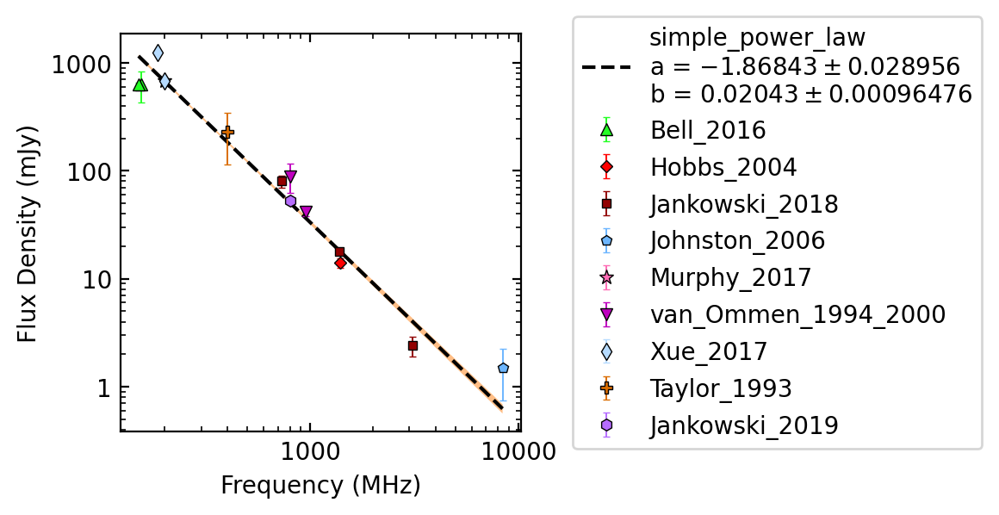

Examples
========

Simple example
--------------

The following can be run to fit J1453-6413

.. code-block:: python

    from pulsar_spectra.catalogues import collect_catalogue_fluxes
    from pulsar_spectra.spectral_fit import find_best_spectral_fit

    cat_list = collect_catalogue_fluxes()
    pulsar = 'J1453-6413'
    freqs, fluxs, flux_errs, refs = cat_list[pulsar]
    find_best_spectral_fit(pulsar, freqs, fluxs, flux_errs, refs, plot_best=True)

This will produce J1453-6413_simple_power_law_fit.png

.. code-block:: bash

    python setup.py install

or

.. code-block:: bash

    pip install .