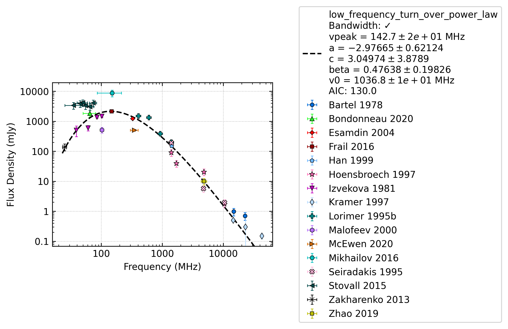
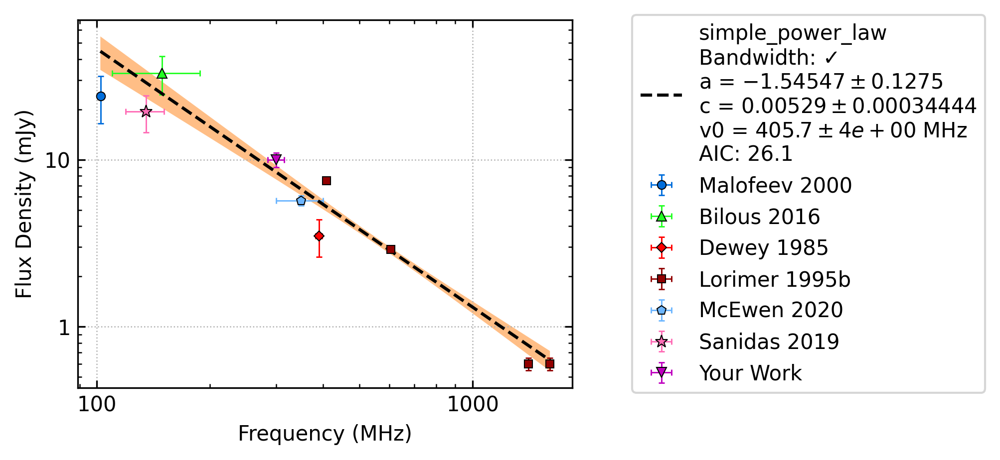
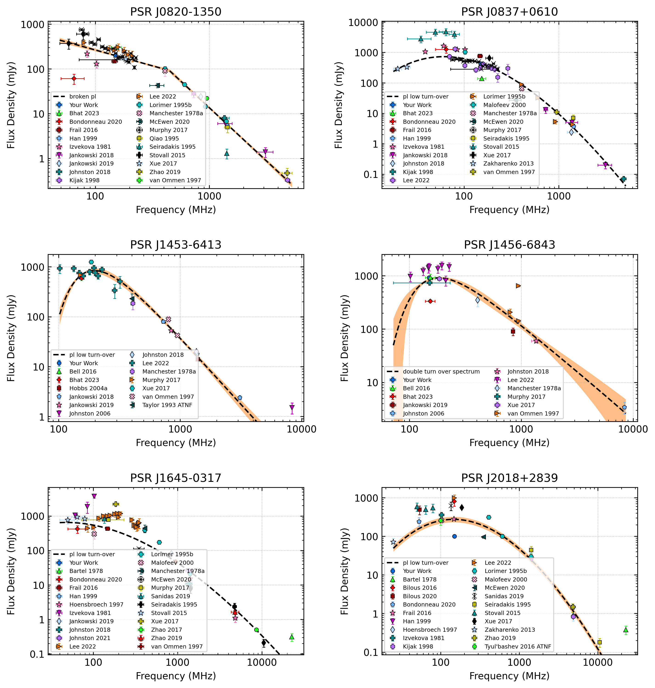

Examples
========

Simple example
--------------

The following can be run to fit J0332+5434

.. script location: example_scripts/simple_example.py
.. code-block:: python

    from pulsar_spectra.catalogue import collect_catalogue_fluxes
    from pulsar_spectra.spectral_fit import find_best_spectral_fit

    cat_dict = collect_catalogue_fluxes()
    pulsar = 'J0332+5434'
    freqs, bands, fluxs, flux_errs, refs = cat_dict[pulsar]
    best_model_name, iminuit_result, fit_info, p_best, p_category = find_best_spectral_fit(pulsar, freqs, bands, fluxs, flux_errs, refs, plot_best=True)

This will produce J0332+5434_low_frequency_turn_over_power_law_fit.png

If you would like to see the result of the best fit you can print them like so

.. code-block:: python

    print(f"Best fit model: {best_model_name}")
    for p, v, e in zip(iminuit_result.parameters, iminuit_result.values, iminuit_result.errors):
        if p.startswith("v"):
            print(f"{p} = {v/1e6:8.1f} +/- {e/1e6:8.1} MHz")
        else:
            print(f"{p} = {v:.5f} +/- {e:.5}")

which will output

.. code-block::

    Best fit model: low_frequency_turn_over_power_law
    vpeak =    161.5 +/-    6e+00 MHz
    a = -2.42975 +/- 0.1469
    c = 1.66104 +/- 0.15576
    beta = 0.69976 +/- 0.019222
    v0 =    753.3 +/-    8e+00 MHz

Adding your data
----------------

Expanding on the previous example you add your own example like so

.. script location: example_scripts/adding_your_data.py
.. code-block:: python

    from pulsar_spectra.catalogue import collect_catalogue_fluxes
    from pulsar_spectra.spectral_fit import find_best_spectral_fit

    cat_list = collect_catalogue_fluxes()
    pulsar = 'J0040+5716'
    freqs, bands, fluxs, flux_errs, refs = cat_list[pulsar]
    freqs += [300.]
    bands += [30.]
    fluxs += [10.]
    flux_errs += [2.]
    refs += ["Your Work"]
    find_best_spectral_fit(pulsar, freqs, bands, fluxs, flux_errs, refs, plot_best=True)

This will also produce J0040+5716_simple_power_law_fit.png with your data included in the fit and plot.

Making a multi pulsar plot
--------------------------

You can create a plot containing multiple pulsars by handing the find_best_spectral_fit a matplotlib axes like so:

.. script location: example_scripts/creating_a_multi_pulsar_plot.py
.. code-block:: python

    import matplotlib.pyplot as plt
    from pulsar_spectra.spectral_fit import find_best_spectral_fit
    from pulsar_spectra.catalogue import collect_catalogue_fluxes

    # Pulsar, flux, flux_err
    pulsar_flux = [
        ('J0820-1350', 200, 9,  0),
        ('J0837+0610', 430, 10, 1),
        ('J1453-6413', 630, 20, 2),
        ('J1456-6843', 930, 25, 3),
        ('J1645-0317', 883, 80, 4),
        ('J2018+2839', 100, 10, 5),
    ]
    cols = 2
    rows = 3
    fig, axs = plt.subplots(nrows=rows, ncols=cols, figsize=(5*cols, 3*rows))

    cat_dict = collect_catalogue_fluxes()
    for pulsar, flux, flux_err, ax_i in pulsar_flux:
        freqs, bands, fluxs, flux_errs, refs = cat_list[pulsar]
        freqs += [150.]
        bands += [10.]
        fluxs += [flux]
        flux_errs += [flux_err]
        refs += ["Your Work"]

        model, m, fit_info, p_best, p_category = find_best_spectral_fit(pulsar, freqs, bands, fluxs, flux_errs, refs, plot_best=True, alternate_style=True, axis=axs[ax_i//cols, ax_i%cols])
        axs[ax_i//cols, ax_i%cols].set_title('PSR '+pulsar)

    plt.tight_layout(pad=2.5)
    plt.savefig("multi_pulsar_spectra.png", bbox_inches='tight', dpi=300)

This will produce the following plot.

Estimate flux density
---------------------

You can use the pulsar's fit to estimate a pulsar's flux density at a certain frequency like so:

.. script location: example_scripts/estimate_flux.py
.. code-block:: python

    from pulsar_spectra.spectral_fit import find_best_spectral_fit, estimate_flux_density
    from pulsar_spectra.catalogue import collect_catalogue_fluxes

    cat_dict = collect_catalogue_fluxes()
    pulsar = 'J0820-1350'
    freqs, bands, fluxs, flux_errs, refs = cat_list[pulsar]
    model, m, _, _, _ = find_best_spectral_fit(pulsar, freqs, bands, fluxs, flux_errs, refs, plot_best=True)
    fitted_flux, fitted_flux_err = estimate_flux_density(150., model, m)
    print(f"{pulsar} estimated flux: {fitted_flux:.1f} ± {fitted_flux_err:.1f} mJy")

Which will output

.. code-block::

    J0820-1350 estimated flux: 197.6 ± 11.6 mJy

Calculate the peak frequency for a log parabolic spectrum fit
-------------------------------------------------------------

Log parabolic spectrum is no longer used by default.
If you turn it back on, you can use the pulsar's fit to calculate the peak frequency like so:

.. script location: example_scripts/peak_frequency_lps.py
.. code-block:: python

    from pulsar_spectra.spectral_fit import find_best_spectral_fit
    from pulsar_spectra.catalogue import collect_catalogue_fluxes
    from pulsar_spectra.analysis import calc_log_parabolic_spectrum_max_freq

    cat_dict = collect_catalogue_fluxes()
    pulsar = 'J1136+1551'
    freqs, bands, fluxs, flux_errs, refs = cat_dict[pulsar]
    model_name, m, _, _, _ = find_best_spectral_fit(pulsar, freqs, bands, fluxs, flux_errs, refs)
    if model_name == "log_parabolic_spectrum":
        v_peak, u_v_peak = calc_log_parabolic_spectrum_max_freq(
            m.values["a"],
            m.values["b"],
            m.values["v0"],
            m.errors["a"],
            m.errors["b"],
            m.covariance[0][1],
        )
        print(f"v_peak (MHz): {v_peak/1e6:6.2f} +/- {u_v_peak/1e6:6.2f}")
    else:
        print("Not a log parabolic spectrum fit")

Which will output

.. code-block::

    v_peak (MHz):  99.77 +/-   6.51

Estimate emission height from a high-frequency cut-off power-law fit
--------------------------------------------------------------------

As demonstrated in Jankowski et al. (2018), we can use the high-frequency cut-off power-law model
from Kontorovich & Flanchick (2013) to estimate the location of the centre of the magnetic polar cap,
assuming a canonical neutron star (radius of 12+/-2 km; Steiner et al., 2018) and a dipole magnetic field.
To perform this calculation, use the in-built function as follows:

.. script location: example_scripts/estimate_emission_height.py
.. code-block:: python

    from pulsar_spectra.spectral_fit import find_best_spectral_fit
    from pulsar_spectra.catalogue import collect_catalogue_fluxes
    from pulsar_spectra.models import calc_high_frequency_cutoff_emission_height

    cat_dict = collect_catalogue_fluxes()
    pulsar = 'J0452-1759'
    freqs, bands, fluxs, flux_errs, refs = cat_dict[pulsar]
    model_name, m, _, _, _ = find_best_spectral_fit(pulsar, freqs, bands, fluxs, flux_errs, refs)
    if model_name == "high_frequency_cut_off_power_law":
        B_pc, u_B_pc, B_surf, B_lc, r_lc, z_e, u_z_e, z_percent, u_z_percent = calc_high_frequency_cutoff_emission_height(
            pulsar,
            m.values[0],
            m.errors[0],
        )
        print(f"B_pc:    ({B_pc/1e11:.2f} +/- {u_B_pc/1e11:.2f})x10^11 G")
        print(f"B_surf:  {B_surf/1e12:.2f}x10^12 G")
        print(f"B_LC:    {B_lc:.2f} G")
        print(f"R_LC:    {r_lc:.0f} km")
        print(f"z_e:     {z_e:.1f} +/- {u_z_e:.1f} km")
        print(f"z/R_LC:  {z_percent:.2f} +/- {u_z_percent:.2f} %")
    else:
        print("Not a power-law with high-frequency cut-off fit")

Which will output

.. code-block::

    B_pc:    (0.22 +/- 0.01)x10^11 G
    B_surf:  1.80x10^12 G
    B_LC:    101.92 G
    R_LC:    26184 km
    z_e:     52.0 +/- 8.7 km
    z/R_LC:  0.20 +/- 0.03 %