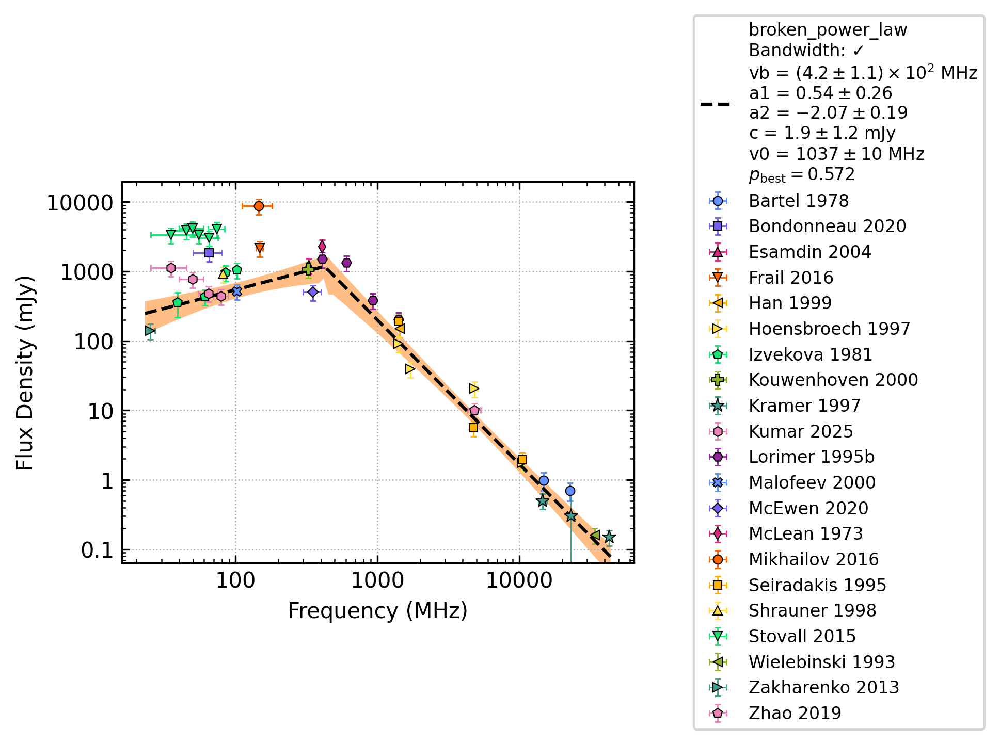
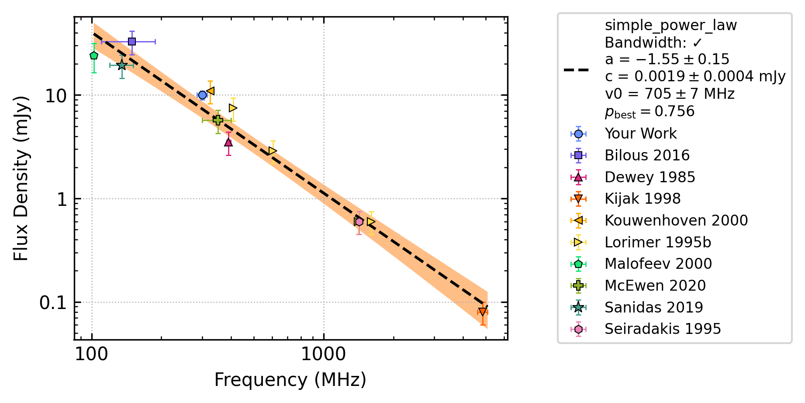
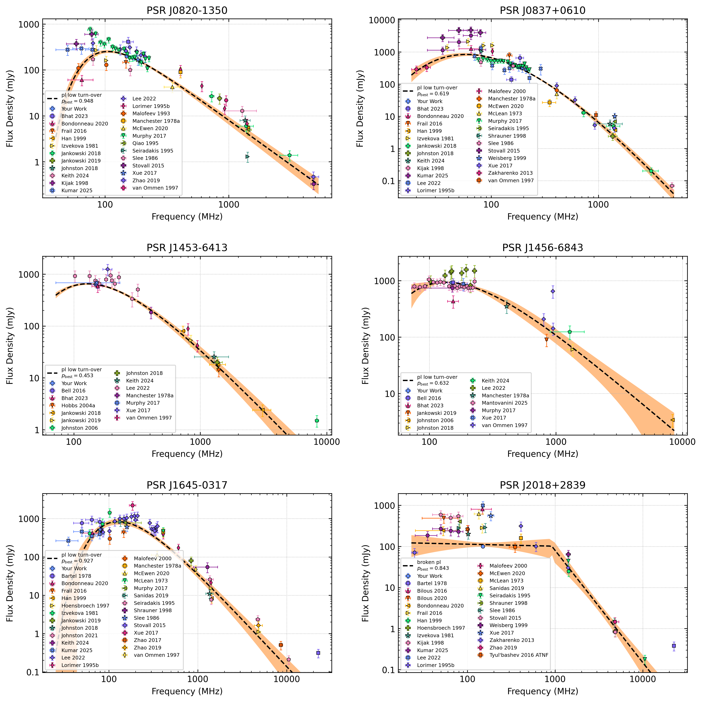

Examples
========

The following examples demonstrate common use cases of the ``pulsar_spectra`` package.
These examples use the defaults for the fitting procedure and catalogue.
We advise your read the documentation in :ref:`catalogue`, :ref:`spectralfit` and :ref:`bandwidth_integration`
to understand our methods and if you need to modify them.

The ``quick-fit`` script
------------------------
For scientific publications, you often want flexibility in the style and content of the plots, and
may want to do your analysis in a programmatic way; in which case, you will likely want to use the
``pulsar_spectra`` library functions directly. However, for quickly finding the best-fit spectra
for pulsars and generating plots with default styling, you can use the ``quick-fit`` command. The
simplest use case is as follows:

.. code-block:: console

    quick-fit -p J0332+5434

This will produce a plot of the best-fit spectrum for J0332+5434 with the default fitting method.
You can select the :ref:`fitting method <fitting-methods>` with ``--method`` and the
:ref:`likelihood function <likelihoods>` with ``--likelihood``. The output plots can be customised
with ``--plot_type``, ``--legend_style``, and ``--point_estimate``. Lastly, for the nested sampling
method, you will likely want to make use of parallelisation. The number of CPUs used can be selected
with ``--npool``. See the help menu (``quick-fit -h``) for more details.

Simple example
--------------

The following code can be run to fit PSR J0332+5434:

.. script location: example_scripts/simple_example.py
.. code-block:: python

    from pulsar_spectra.catalogue import collect_catalogue_fluxes
    from pulsar_spectra.spectral_fit import find_best_spectral_fit

    cat_dict = collect_catalogue_fluxes()
    pulsar = "J0332+5434"
    freqs, bands, fluxs, flux_errs, limit_signs, refs = cat_dict[pulsar]

    result = find_best_spectral_fit(
        pulsar, freqs, bands, fluxs, flux_errs, limit_signs, refs, plot_best=True
    )

This will produce ``J0332+5434_broken_power_law_maximum-likelihood_Huber_best_fit.png``.

If you would like to see the result of the best fit (using the ``maximum-likelihood`` method) you
can print them like so:

.. script location: example_scripts/simple_example.py
.. code-block:: python

    print(f"Best fit model: {result.model}")
    for p, v in result.params.items():
        e = result.param_errs[p]
        if p.startswith("v"):
            print(f"{p} = {v:.1f} +/- {e:.1f} MHz")
        else:
            print(f"{p} = {v:.5f} +/- {e:.5f}")

which will output

.. code-block::

    Best fit model: broken_power_law
    vb = 424.3 +/- 106.0 MHz
    a1 = 0.53597 +/- 0.26117
    a2 = -2.07291 +/- 0.19047
    c = 1.90527 +/- 1.17645
    v0 = 1036.8 +/- 10.4 MHz

Adding your data
----------------

Expanding on the previous example, you add your own data to the fit as follows:

.. script location: example_scripts/adding_your_data.py
.. code-block:: python

    from pulsar_spectra.catalogue import collect_catalogue_fluxes
    from pulsar_spectra.spectral_fit import find_best_spectral_fit

    cat_list = collect_catalogue_fluxes()
    pulsar = "J0040+5716"
    freqs, bands, fluxs, flux_errs, limit_signs, refs = cat_list[pulsar]
    freqs = [300.0] + freqs
    bands = [30.0] + bands
    fluxs = [10.0] + fluxs
    flux_errs = [2.0] + flux_errs
    limit_signs = [0] + limit_signs
    refs = ["Your Work"] + refs

    result = find_best_spectral_fit(
        pulsar, freqs, bands, fluxs, flux_errs, limit_signs, refs, plot_best=True
    )

This will produce ``J0040+5716_simple_power_law_maximum-likelihood_Huber_best_fit.png`` with your
data included in the fit and plot.

.. _multi_plot:

Making a multi pulsar plot
--------------------------

You can create a plot containing multiple pulsars by handing ``find_best_spectral_fit()`` a matplotlib axis like so:

.. script location: example_scripts/creating_a_multi_pulsar_plot.py
.. code-block:: python

    import matplotlib.pyplot as plt

    from pulsar_spectra.catalogue import collect_catalogue_fluxes
    from pulsar_spectra.spectral_fit import find_best_spectral_fit

    # Pulsar, flux, flux_err
    pulsar_flux = [
        ("J0820-1350", 200, 9, 0),
        ("J0837+0610", 430, 10, 1),
        ("J1453-6413", 630, 20, 2),
        ("J1456-6843", 930, 25, 3),
        ("J1645-0317", 983, 80, 4),
        ("J2018+2839", 100, 10, 5),
    ]
    cols = 2
    rows = 3
    fig, axs = plt.subplots(nrows=rows, ncols=cols, figsize=(6 * cols, 4 * rows))

    cat_dict = collect_catalogue_fluxes()
    for pulsar, flux, flux_err, ax_i in pulsar_flux:
        freqs, bands, fluxs, flux_errs, limit_signs, refs = cat_dict[pulsar]
        freqs = [150.0] + freqs
        bands = [10.0] + bands
        fluxs = [flux] + fluxs
        flux_errs = [flux_err] + flux_errs
        limit_signs = [0] + limit_signs
        refs = ["Your Work"] + refs

        find_best_spectral_fit(
            pulsar,
            freqs,
            bands,
            fluxs,
            flux_errs,
            limit_signs,
            refs,
            plot_best=True,
            legend_style="compact",
            plot_kwargs={"axis": axs[ax_i // cols, ax_i % cols]},
        )
        axs[ax_i // cols, ax_i % cols].set_title("PSR " + pulsar)

    fig.tight_layout(pad=2.5)
    fig.savefig("multi_pulsar_spectra.png", bbox_inches="tight", dpi=300)

This will produce the following plot.

To make the marker types consistent across all subplots, see
:ref:`Generating a consistent marker set for a multi-pulsar plot <consistent_markers>`.

Estimate flux density
---------------------

You can use the pulsar's fit to estimate a pulsar's flux density at a certain frequency like so:

.. script location: example_scripts/estimate_flux.py
.. code-block:: python

    from pulsar_spectra.analysis import estimate_flux_density
    from pulsar_spectra.catalogue import collect_catalogue_fluxes
    from pulsar_spectra.spectral_fit import find_best_spectral_fit

    cat_dict = collect_catalogue_fluxes()
    pulsar = "J0820-1350"
    freqs, bands, fluxs, flux_errs, limit_signs, refs = cat_dict[pulsar]

    result = find_best_spectral_fit(
        pulsar,
        freqs,
        bands,
        fluxs,
        flux_errs,
        limit_signs,
        refs,
    )

    fitted_flux, fitted_flux_err = estimate_flux_density(150.0, result.model, result.fit_results[result.model])

    print(f"{pulsar} estimated flux: {fitted_flux:.1f} ± {fitted_flux_err:.1f} mJy")

Which will output

.. code-block::

    J0820-1350 estimated flux: 225.4 ± 21.9 mJy

.. NOTE: Commented out because the LPS model is no longer included

.. Calculate the peak frequency for a log parabolic spectrum fit
.. -------------------------------------------------------------

.. Log parabolic spectrum is no longer used by default.
.. If you turn it back on, you can use the pulsar's fit to calculate the peak frequency like so:

.. .. script location: example_scripts/peak_frequency_lps.py
.. .. code-block:: python

..     from pulsar_spectra.catalogue import collect_catalogue_fluxes
..     from pulsar_spectra.spectral_fit import find_best_spectral_fit
..     from pulsar_spectra.analysis import calc_log_parabolic_spectrum_max_freq

..     cat_dict = collect_catalogue_fluxes()
..     pulsar = "J1136+1551"
..     freqs, bands, fluxs, flux_errs, refs = cat_dict[pulsar]

..     best_model_name, _, fit_results, _, _ = find_best_spectral_fit(
..         pulsar,
..         freqs,
..         bands,
..         fluxs,
..         flux_errs,
..         refs,
..     )

..     if best_model_name == "log_parabolic_spectrum":
..         result = fit_results[best_model_name]

..         v_peak, u_v_peak = calc_log_parabolic_spectrum_max_freq(
..             result.values["a"],
..             result.values["b"],
..             result.values["v0"],
..             result.errors["a"],
..             result.errors["b"],
..             result.covariance[0][1],
..         )
..         print(f"v_peak (MHz): {v_peak/1e6:.2f} +/- {u_v_peak/1e6:.2f}")
..     else:
..         print("Not a log parabolic spectrum fit")

.. Which will output

.. .. code-block

..     v_peak (MHz):  99.77 +/-   6.51

Estimate emission height from a high-frequency cut-off power-law fit
--------------------------------------------------------------------

As demonstrated in Jankowski et al. (2018), we can use the high-frequency cut-off power-law model
from Kontorovich & Flanchick (2013) to estimate the location of the centre of the magnetic polar cap,
assuming a canonical neutron star (radius of 12+/-2 km; Steiner et al., 2018) and a dipole magnetic field.
To perform this calculation, use the in-built function as follows:

.. script location: example_scripts/estimate_emission_height.py
.. code-block:: python

    from pulsar_spectra.analysis import calc_high_frequency_cutoff_emission_height
    from pulsar_spectra.catalogue import collect_catalogue_fluxes
    from pulsar_spectra.spectral_fit import find_best_spectral_fit

    cat_dict = collect_catalogue_fluxes()
    pulsar = "J0955-5304"
    freqs, bands, fluxs, flux_errs, limit_signs, refs = cat_dict[pulsar]

    result = find_best_spectral_fit(
        pulsar,
        freqs,
        bands,
        fluxs,
        flux_errs,
        limit_signs,
        refs,
    )

    if result.model == "high_frequency_cut_off_power_law":
        B_pc, u_B_pc, B_surf, B_lc, r_lc, z_e, u_z_e, z_percent, u_z_percent = calc_high_frequency_cutoff_emission_height(
            pulsar,
            result.params["vc"] * 1e6,
            result.param_errs["vc"] * 1e6,
        )
        print(f"B_pc:    ({B_pc / 1e11:.2f} +/- {u_B_pc / 1e11:.2f})x10^11 G")
        print(f"B_surf:  {B_surf / 1e12:.2f}x10^12 G")
        print(f"B_LC:    {B_lc:.2f} G")
        print(f"R_LC:    {r_lc:.0f} km")
        print(f"z_e:     {z_e:.1f} +/- {u_z_e:.1f} km")
        print(f"z/R_LC:  {z_percent:.2f} +/- {u_z_percent:.2f} %")
    else:
        print(f"Best model was {result.model}, not a power-law with high-frequency cut-off fit")

Which will output

.. code-block::

    B_pc:    (0.37 +/- 0.05)x10^11 G
    B_surf:  1.76x10^12 G
    B_LC:    25.80 G
    R_LC:    41123 km
    z_e:     43.6 +/- 7.5 km
    z/R_LC:  0.11 +/- 0.02 %