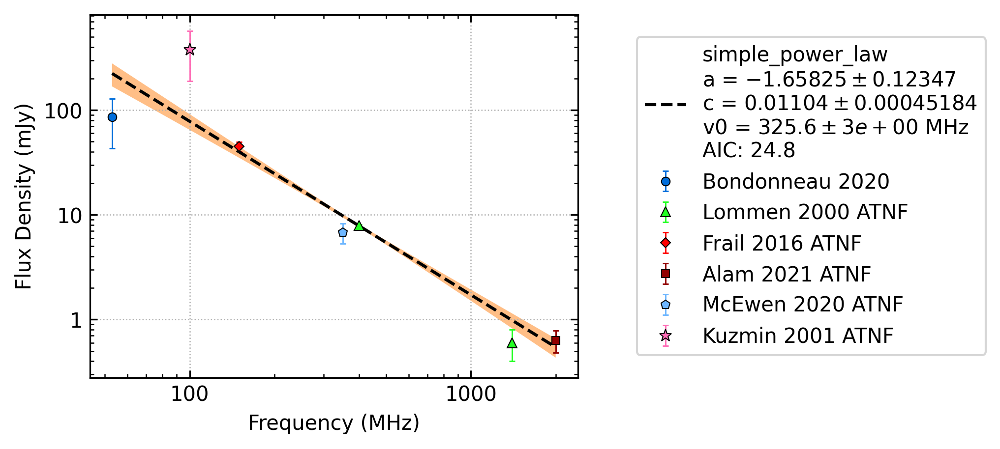

Frequently Asked Questions
==========================

The following are some common questions or issues.

What are these x error bars?
----------------------------
The x error bars are the bandwidth of each flux density measurement (:ref:`see full explanation <display_band>`).

ATNF reference error
--------------------

If you see an error that looks similar to this:

.. code-block:: python

    Traceback (most recent call last):
    File "sifit.py", line 10, in <module>
        cat_list = collect_catalogue_fluxes()
    File "/pawsey/mwa/software/python3/pulsar_spectra/master/lib/python3.8/site-packages/pulsar_spectra/catalogue.py", line 267, in collect_catalogue_fluxes
        antf_dict = all_flux_from_atnf(query=query)
    File "/pawsey/mwa/software/python3/pulsar_spectra/master/lib/python3.8/site-packages/pulsar_spectra/catalogue.py", line 176, in all_flux_from_atnf
        freq_all, flux_all, flux_err_all, references = flux_from_atnf(jname, query=query, ref_dict=ref_dict)
    File "/pawsey/mwa/software/python3/pulsar_spectra/master/lib/python3.8/site-packages/pulsar_spectra/catalogue.py", line 140, in flux_from_atnf
        ref = convert_antf_ref(ref_code, ref_dict=ref_dict)
    File "/pawsey/mwa/software/python3/pulsar_spectra/master/lib/python3.8/site-packages/pulsar_spectra/catalogue.py", line 50, in convert_antf_ref
        ref_string_list = ref_dict[ref_code].split()
    KeyError: 'bgt+21'

The KeyError is likely due to a change in the in ``psrcat.db`` file that ``psrqpy`` has not updated in their cache. To fix it run the following command

.. code-block:: python

    import psrqpy
    psrqpy.get_references(updaterefcache=True)
    psrqpy.QueryATNF(checkupdate=True)

Then try your script again.

ATNF label on plot
------------------

If you see a reference label ending in \_ATNF (see below for an example), those flux density measurements were imported from the ATNF catalogue.

The ATNF catalogue values often record flux density measurements at the nearest standard frequency
which can be inaccurate and should be replaced with the actual value.
If you see the \_ATNF label, you should :ref:`look up the ATNF reference <look_up_ATNF>` and
:ref:`incorporate the true values into the pulsar_spectra catalouge<adding_papers>`.