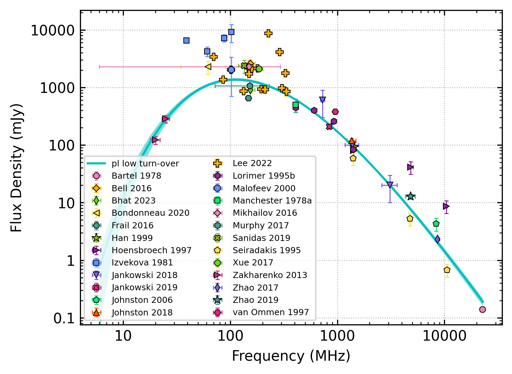
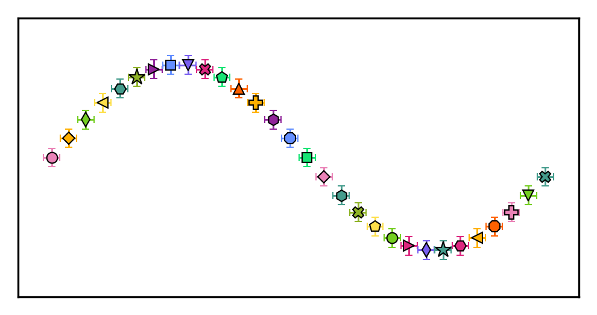
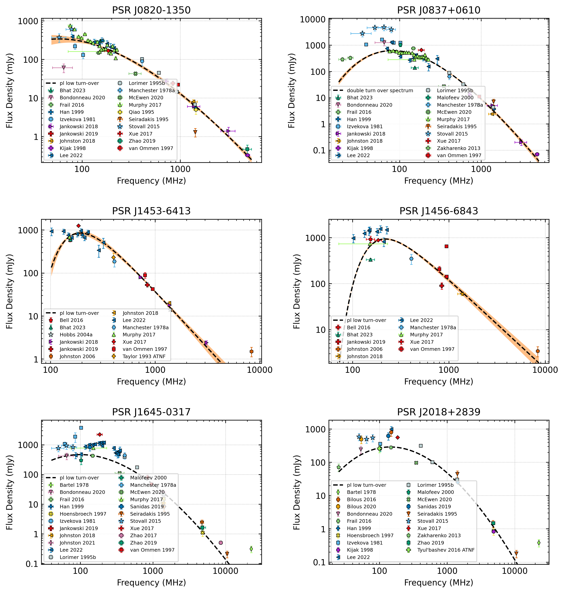

Plotting
========

Below we describe additional features available for customising spectral plots.

Creating publication-quality plots
----------------------------------

By default, the legend will be positioned to the right of the figure box with the best-fit parameter values and the
full model name. The automated plotting includes an alternative, more compact figure style with the legend included
within the figure box and with an abbreviated model name and no fit info. This is done using the following code:

.. code-block:: python

    from pulsar_spectra.catalogue import collect_catalogue_fluxes
    from pulsar_spectra.spectral_fit import find_best_spectral_fit

    cat_dict = collect_catalogue_fluxes()
    pulsar = 'J1909-3744'
    freqs, bands, fluxs, flux_errs, refs = cat_dict[pulsar]
    best_model_name, iminuit_result, fit_info, p_best, p_category = find_best_spectral_fit(pulsar, freqs, bands, fluxs, flux_errs, refs, plot_best=True)

This will produce the following plot:

.. image:: figures/example_alternate_style.png
  :width: 800

.. _custom_markers:

Using custom marker types
-------------------------

By default, the code will cycle through a set list of marker types. When creating figures for multiple pulsars, the 
default marker assignment can lead to inconsistency in the marker types. This can be solved by assigning a custom
marker to each reference. You can specify custom marker types using the following code:

.. code-block:: python

    from pulsar_spectra.catalogue import collect_catalogue_fluxes
    from pulsar_spectra.spectral_fit import find_best_spectral_fit

    custom_markers = {
    #   reference           :   (marker colour, marker type, marker size)
        "Jankowski_2018"    :   ('magenta', 'h', 5), # orange circle
        "Jankowski_2019"    :   ('cyan', 'H', 5)  # green diamond
    }

    cat_dict = collect_catalogue_fluxes()
    pulsar = 'J1909-3744'
    freqs, bands, fluxs, flux_errs, refs = cat_dict[pulsar]
    best_model_name, iminuit_result, fit_info, p_best, p_category = find_best_spectral_fit(pulsar, freqs, bands, fluxs, flux_errs, refs, plot_best=True, ref_markers=custom_markers)

This will produce the following plot:

.. image:: figures/example_custom_markers.png
  :width: 800

In `Lee et al. (2022) <https://ui.adsabs.harvard.edu/abs/2022PASA...39...42L/abstract>`, 32 custom marker types were created to ensure unique and consistent markers were
used throughout the figures. These custom marker types are proved below:

.. code-block:: python

    msc = 0.8 # marker scale
    ref_markers = {
    #   Reference               : (colour, type, size),           # marker description
        'This work'             : ("#006ddb",   "o", 7*msc),      # blue circle
        'Bartel_1978'           : ("#009292",   "^", 7*msc),      # turquoise triangle
        'Bell_2016'             : ("m",         "v", 7*msc),      # purple upside-down triangle
        'Bilous_2016'           : ("m",         "X", 7.5*msc),    # purple thick cross
        'Bilous_2020'           : ("y",         "*", 10*msc),     # yellow star
        'Bondonneau_2020'       : ("#db6d00",   ">", 7*msc),      # orange right-pointing triangle
        'Dai_2015'              : ("#920000",   "X", 7*msc),      # maroon thick cross
        'Hobbs_2004'            : ("tab:orange","s", 5.5*msc),    # orange square
        'Izvekova_1981'         : ("#ffb6db",   "X", 7.5*msc),    # light pink thick cross
        'Jankowski_2018'        : ("c",         "H", 7*msc),      # cyan sideways hexagon
        'Jankowski_2019'        : ("#009292",   "P", 7.5*msc),    # turqoise thick plus
        'Johnston_1993'         : ("tab:green", "p", 6.5*msc),    # dark green pentagon
        'Johnston_2006'         : ("y",         "P", 7.5*msc),    # yellow thick plus
        'Johnston_2018'         : ("#b6dbff",   "d", 7*msc),      # light blue thin diamond
        'Johnston_2021'         : ("y",         "s", 5.5*msc),    # yellow square
        'Keith_2011'            : ("#ff6db6",   "d", 7*msc),      # pink thin diamond
        'Lorimer_1995'          : ("tab:orange","X", 7*msc),      # orange thick cross
        'Malofeev_2000'         : ("r",         "P", 7.5*msc),    # red thick plus
        'Mignani_2017'          : ("g",         "D", 5*msc),      # green diamond
        'Murphy_2017'           : ("#ff6db6",   "*", 10*msc),     # pink star
        'Sanidas_2019'          : ("k",         "d", 7*msc),      # black thin diamond
        'Sieber_1973'           : ("#6db6ff",   "p", 6*msc),      # sky blue pentagon
        'Stovall_2015'          : ("#920000",   "s", 5*msc),      # maroon small square
        'van_Ommen_1997'        : ("#24ff24",   "^", 7*msc),      # green triangle
        'Xue_2017'              : ("r",         "D", 6*msc),      # red diamond
        'Zakharenko_2013'       : ("#b66dff",   "h", 7*msc),      # lavender hexagon
        'Zhao_2019'             : ("#004949",   "<", 7*msc),      # dark green left-pointing triangle
        'Manchester_1978_ATNF'  : ("tab:purple","s", 5*msc),      # purple small square
        'Toscano_1998_ATNF'     : ("tab:orange","d", 7*msc),      # orange thin diamond
        'Kramer_1999_ATNF'      : ("y",         "o", 5*msc),      # yellow small circle
        'Qiao_1995_ATNF'        : ("tab:olive", "<", 6*msc),      # olive small left-pointing triangle
        'Tyul\'bashev_2016_ATNF': ("k",         "o", 5*msc),      # black small circle
    }

Plotting a secondary model
--------------------------

Sometimes you may want to plot more than one best-fit model on the same figure with different subsets of data included
in the fit. To differentiate between the two models, we have included an alternate model style which is light grey
and does not show the uncertainty envelope. For example, the following code can be used to show the model fit
before and after the addition of your data:

.. code-block:: python

    import matplotlib.pyplot as plt
    from pulsar_spectra.catalogue import collect_catalogue_fluxes
    from pulsar_spectra.spectral_fit import find_best_spectral_fit

    cat_dict = collect_catalogue_fluxes()
    pulsar = 'J1909-3744'
    freqs, bands, fluxs, flux_errs, refs = cat_dict[pulsar]

    fig, ax = plt.subplots(figsize=(5,4))
    find_best_spectral_fit(pulsar, freqs, bands, fluxs, flux_errs, refs, plot_best=True, secondary_fit=True, axis=ax)

    freqs = [150.] + freqs
    bands = [30.] + bands
    fluxs = [6.] + fluxs
    flux_errs = [1.] + flux_errs
    refs = ['Your Work'] + refs
    best_model_name, iminuit_result, fit_info, p_best, p_category = find_best_spectral_fit(pulsar, freqs, bands, fluxs, flux_errs, refs, plot_best=True, axis=ax)

    plt.savefig(pulsar+'_'+best_model_name+'_fit.png', bbox_inches='tight', dpi=300)

This will produce the following plot:

.. image:: figures/example_secondary_fit.png
  :width: 800

Creating a custom plotting configuration
----------------------------------------

The figure, marker, and model styles are specified in the plotting_config.yaml file.
Customisation of the plotting configuration is made easy with the build_plotting_config.py script.
Information about all available customisations can be found in the help menu:

.. code-block::
    build_plotting_config.py -h

The default configuration is created by omitting all command line inputs,
which will write to a file called plotting_config.yaml in the current directory.
If you customise the configuration and want to make it the new default,
you can replace the default plotting_config.yaml (located in pulsar_spectra/configs)
and then reinstall pulsar_spectra from the source code directory:

.. code-block::
    pip install .

If you would like to use a non-default configuration in your script, you can
include it by giving the file path to find_best_spectral_fit like so:

.. code-block:: python

    from pulsar_spectra.catalogue import collect_catalogue_fluxes
    from pulsar_spectra.spectral_fit import find_best_spectral_fit

    cat_dict = collect_catalogue_fluxes()
    pulsar = 'J0953+0755'
    freqs, bands, fluxs, flux_errs, refs = cat_dict[pulsar]
    best_model_name, iminuit_result, fit_info, p_best, p_category = find_best_spectral_fit(pulsar, freqs, bands, fluxs, flux_errs, refs, plot_best=True, plotting_config='custom_plotting_config.yaml')

In the following example, we want to make the following customisations:
- Increase the figure width to 4 inches (keeping the default aspect ratio)
- Change the line style of the primary model to a solid line
- Change the colour of the model and model error regions to cyan
- Generate a set of unique and randomised markers with the IBM colour palette
- Save the file as custom_plotting_config.yaml

This can be done with the command

.. code-block::
    build_plotting_config.py \
    --fig_height 4 \
    --primary_ls - \
    --model_colour c \
    --model_error_colour c
    --generate_markers \
    --shuffle \
    --palette IBM \
    -F custom_plotting_config.yaml

The result is the following plot

By default, the '--generate_markers' (or just '-g') option will create a set of
30 unique markers, which will be ordered based on the order of the colour palette
and marker type lists (currently hard-coded in build_plotting_config.py).
You can use the '--num_markers' option to increase the size of the unique marker set,
and the '--shuffle' option to shuffle the order of markers and colours.
Please note that the shuffle option is not completely random. All of the makers types
will be used up before a marker type is reused, and the same is true for the marker colours.

If you would like to save the generated marker set, you can use the '--marker_file_savename'
option to specify a file to write to. This can then be imported with the '--marker_file' option.
You can preview the generated marker set using '--marker_preview',
producing marker_preview.png:

Generating a consistent marker set for a multi-pulsar plot
----------------------------------------------------------

As discussed in :ref:`Using custom markers <custom markers>`, you may want to
use a consistent set of markers when showing :ref:`spectral plots side by side <multi plot>`.
This is may easy with the build_plotting_config.py script. To generate a
consistent marker set for a set of pulsars, use the '-pulsars' (or '-p') option:

.. code-block::
    build_plotting_config.py \
    --primary_ls - \
    --model_colour c \
    --model_error_colour c
    --generate_markers \
    --shuffle \
    --palette WONG \
    -F custom_plotting_config.yaml \
    -p J0820-1350 J0837+0610 J1453-6413 J1456-6843 J1645-0317 J2018+2839

In addition to custom_plotting_config.yaml, this will also generate ref_markers.yaml.
You can then import them in a multi-pulsar plot like so:

.. code-block:: python

    import yaml
    import matplotlib.pyplot as plt
    from pulsar_spectra.spectral_fit import find_best_spectral_fit
    from pulsar_spectra.catalogue import collect_catalogue_fluxes

    with open('ref_markers.yaml', 'r') as f:
        ref_markers = yaml.safe_load(f)

    pulsars = [
        'J0820-1350',
        'J0837+0610',
        'J1453-6413',
        'J1456-6843',
        'J1645-0317',
        'J2018+2839'
    ]

    cols = 2
    rows = 3
    fig, axs = plt.subplots(nrows=rows, ncols=cols, figsize=(5*cols, 3.5*rows))

    cat_dict = collect_catalogue_fluxes()
    for ax_i, pulsar in enumerate(pulsars):
        freqs, bands, fluxs, flux_errs, refs = cat_dict[pulsar]
        model, m, fit_info, p_best, p_category = find_best_spectral_fit(pulsar, freqs, bands, fluxs, flux_errs, refs, plot_best=True, alternate_style=True, axis=axs[ax_i//cols, ax_i%cols], ref_markers=ref_markers)
        axs[ax_i//cols, ax_i%cols].set_title('PSR '+pulsar)

    plt.tight_layout(pad=2.5)
    plt.savefig("multi_pulsar_spectra.png", bbox_inches='tight', dpi=300)

This will produce multi_pulsar_spectra.png:

You can add your own data as shown `here <multi plot>`. You can then add a custom marker
for your own data by adding a new entry to the 'ref_markers' dictionary. For example:

.. code-block:: python

    ref_markers["Your Work"] = ['green', 'o', 7]