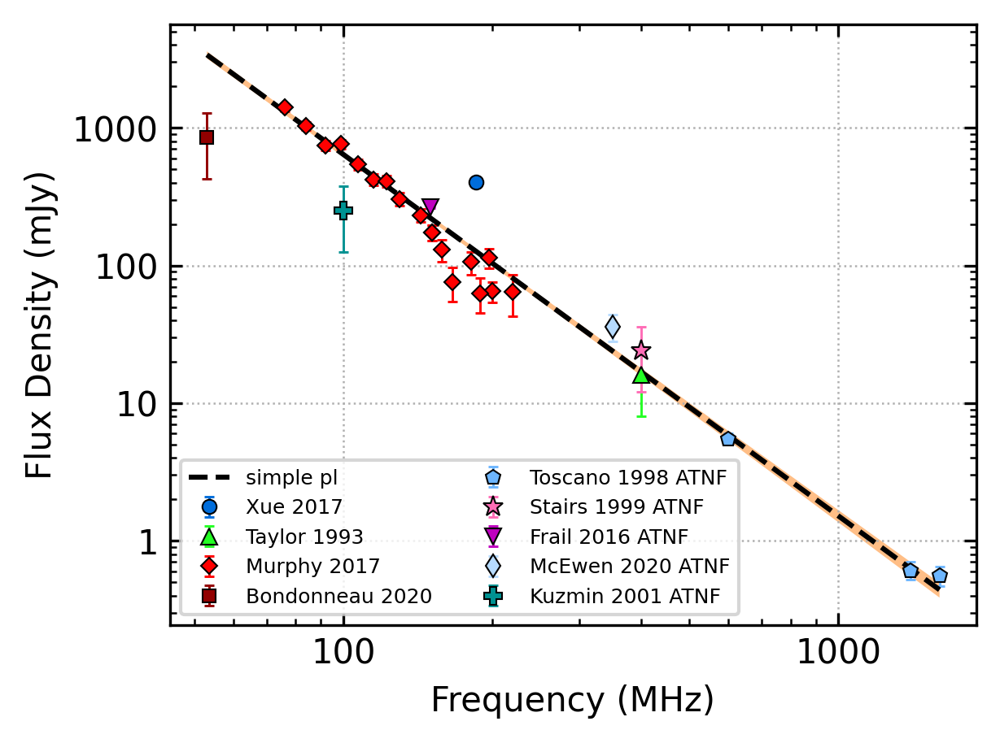
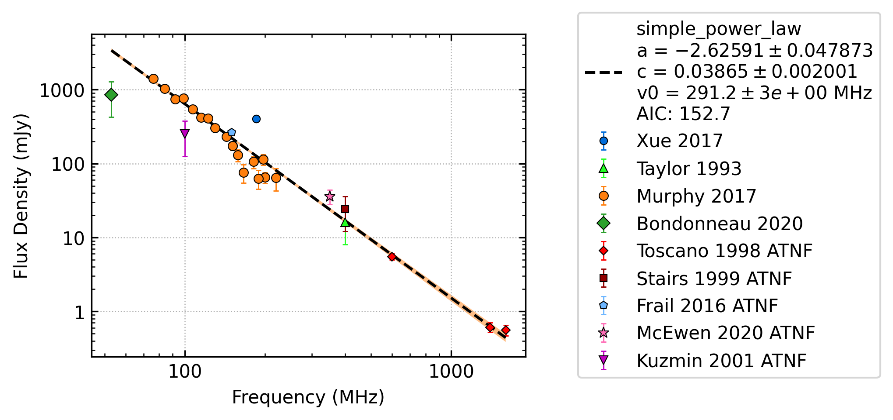
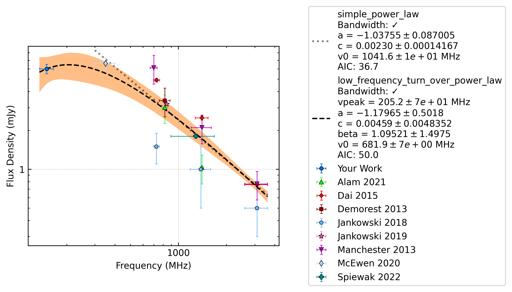

Plotting
========

Below we describe additional features available for customising spectral plots.

Creating publication-quality plots
----------------------------------

By default, the legend will be positioned to the right of the figure box with the best-fit parameter values and the
full model name. The automated plotting includes an alternative, more compact figure style with the legend included
within the figure box and with an abbreviated model name and no fit info. This is done using the following code:

.. code-block:: python

    from pulsar_spectra.catalogue import collect_catalogue_fluxes
    from pulsar_spectra.spectral_fit import find_best_spectral_fit

    cat_dict = collect_catalogue_fluxes()
    pulsar = 'J0034-0534'
    freqs, fluxs, flux_errs, refs = cat_dict[pulsar]
    best_model_name, iminuit_result, fit_info, p_best, p_category = find_best_spectral_fit(pulsar, freqs, fluxs, flux_errs, refs, plot_best=True, alternate_style=True)

This will produce the following plot:

Using custom marker types
-------------------------

By default, the marker types will cycle through a set list of marker types. If you would like to use custom marker
types, you can specify them using the following code:

.. code-block:: python

    from pulsar_spectra.catalogue import collect_catalogue_fluxes
    from pulsar_spectra.spectral_fit import find_best_spectral_fit

    custom_markers = {
    #   reference           :   (marker colour, marker type, marker size)
        "Murphy_2017"       :   ('tab:orange', 'o', 5), # orange circle
        "Bondonneau_2020"   :   ('tab:green',  'D', 5)  # green diamond
    }

    cat_dict = collect_catalogue_fluxes()
    pulsar = 'J0034-0534'
    freqs, fluxs, flux_errs, refs = cat_dict[pulsar]
    best_model_name, iminuit_result, fit_info, p_best, p_category = find_best_spectral_fit(pulsar, freqs, fluxs, flux_errs, refs, plot_best=True, ref_markers=custom_markers)

This will produce the following plot:

In Lee et al. (2022, submitted), 32 custom marker types were created to ensure unique and consistent markers were
used throughout the figures. These custom marker types are proved below:

.. code-block:: python

    msc = 0.8 # marker scale
    ref_markers = {
    #   Reference               : (colour, type, size),           # marker description
        'This work'             : ("#006ddb",   "o", 7*msc),      # blue circle
        'Bartel_1978'           : ("#009292",   "^", 7*msc),      # turquoise triangle
        'Bell_2016'             : ("m",         "v", 7*msc),      # purple upside-down triangle
        'Bilous_2016'           : ("m",         "X", 7.5*msc),    # purple thick cross
        'Bilous_2020'           : ("y",         "*", 10*msc),     # yellow star
        'Bondonneau_2020'       : ("#db6d00",   ">", 7*msc),      # orange right-pointing triangle
        'Dai_2015'              : ("#920000",   "X", 7*msc),      # maroon thick cross
        'Hobbs_2004'            : ("tab:orange","s", 5.5*msc),    # orange square
        'Izvekova_1981'         : ("#ffb6db",   "X", 7.5*msc),    # light pink thick cross
        'Jankowski_2018'        : ("c",         "H", 7*msc),      # cyan sideways hexagon
        'Jankowski_2019'        : ("#009292",   "P", 7.5*msc),    # turqoise thick plus
        'Johnston_1993'         : ("tab:green", "p", 6.5*msc),    # dark green pentagon
        'Johnston_2006'         : ("y",         "P", 7.5*msc),    # yellow thick plus
        'Johnston_2018'         : ("#b6dbff",   "d", 7*msc),      # light blue thin diamond
        'Johnston_2021'         : ("y",         "s", 5.5*msc),    # yellow square
        'Keith_2011'            : ("#ff6db6",   "d", 7*msc),      # pink thin diamond
        'Lorimer_1995'          : ("tab:orange","X", 7*msc),      # orange cross
        'Malofeev_2000'         : ("r",         "P", 7.5*msc),    # red thick plus
        'Mignani_2017'          : ("g",         "D", 5*msc),      # green diamond
        'Murphy_2017'           : ("#ff6db6",   "*", 10*msc),     # pink star
        'Sanidas_2019'          : ("k",         "d", 7*msc),      # black thin diamond
        'Sieber_1973'           : ("#6db6ff",   "p", 6*msc),      # sky blue pentagon
        'Stovall_2015'          : ("#920000",   "s", 5*msc),      # maroon small square
        'van_Ommen_1997'        : ("#24ff24",   "^", 7*msc),      # green triangle
        'Xue_2017'              : ("r",         "D", 6*msc),      # red diamond
        'Zakharenko_2013'       : ("#b66dff",   "h", 7*msc),      # lavender hexagon
        'Zhao_2019'             : ("#004949",   "<", 7*msc),      # dark green right-pointing triangle
        'Manchester_1978_ATNF'  : ("tab:purple","s", 5*msc),      # purple small square
        'Toscano_1998_ATNF'     : ("tab:orange","d", 7*msc),      # orange thin diamond
        'Kramer_1999_ATNF'      : ("y",         "o", 5*msc),      # yellow small circle
        'Qiao_1995_ATNF'        : ("tab:olive", "<", 6*msc),      # olive small left-pointing triangle
        'Tyul\'bashev_2016_ATNF': ("k",         "o", 5*msc),      # black small circle
    }

Plotting a secondary model
--------------------------

Sometimes you may want to plot more than one best-fit model on the same figure with different subsets of data included
in the fit. To differentiate between the two models, we have included an alternate model style which is light grey
and does not show the uncertainty envelope. An example of how to use this is given below:

.. code-block:: python

    import matplotlib.pyplot as plt
    from pulsar_spectra.catalogue import collect_catalogue_fluxes
    from pulsar_spectra.spectral_fit import find_best_spectral_fit

    cat_dict    = collect_catalogue_fluxes()
    cat_dict_2  = collect_catalogue_fluxes(exclude=["Murphy_2017"])
    pulsar = 'J0034-0534'
    freqs, fluxs, flux_errs, refs = cat_dict[pulsar]
    freqs_2, fluxs_2, flux_errs_2, refs_2 = cat_dict_2[pulsar]

    plotsize = 3.2
    fig, ax = plt.subplots(figsize=(plotsize*4/3, plotsize))
    best_model_name, iminuit_result, fit_info, p_best, p_category = find_best_spectral_fit(pulsar, freqs, fluxs, flux_errs, refs, plot_best=True, axis=ax)
    best_model_name_2, iminuit_result_2, fit_info_2, p_best_2, p_category_2 = find_best_spectral_fit(pulsar, freqs_2, fluxs_2, flux_errs_2, refs_2, plot_best=True, secondary_fit=True, axis=ax)

    plt.savefig(pulsar+'_'+best_model_name+'_fit.png', bbox_inches='tight', dpi=300)

This will produce the following plot:

