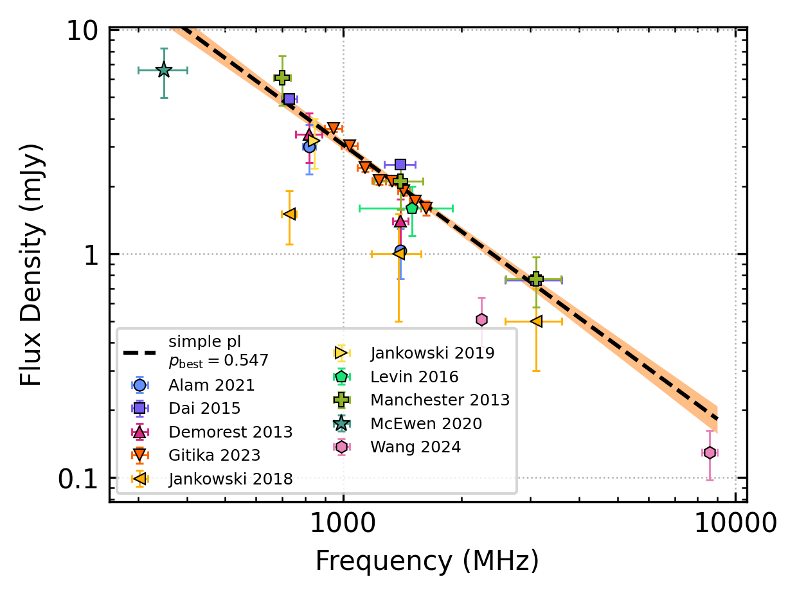
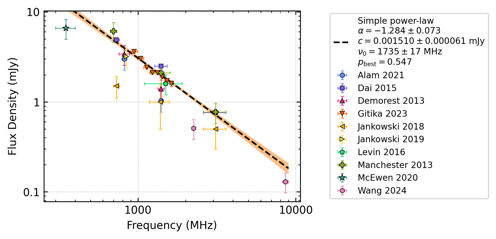
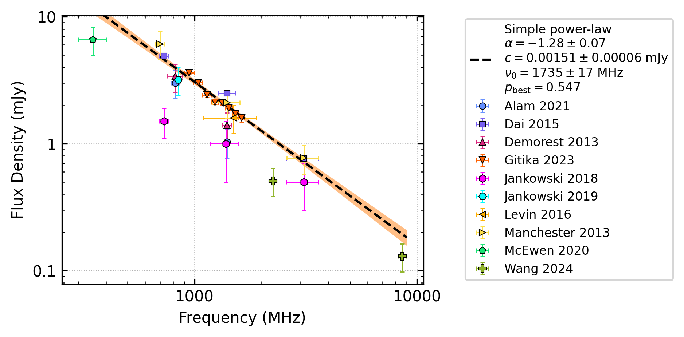
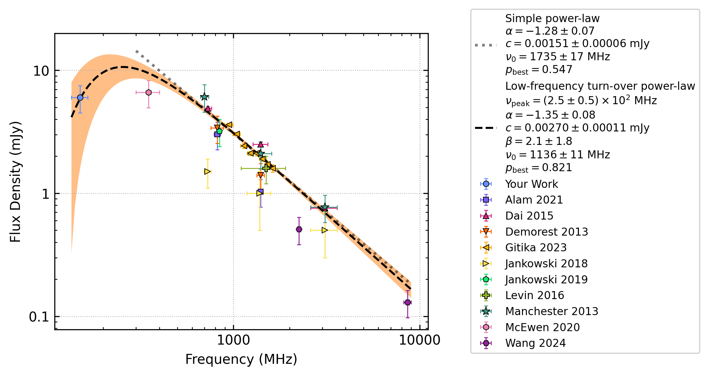
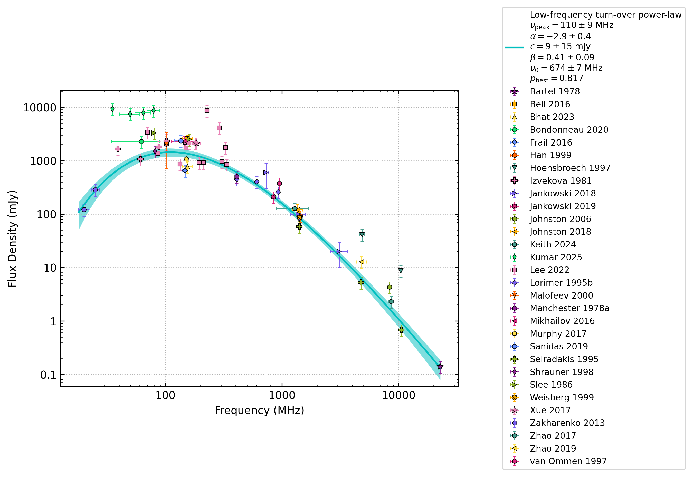
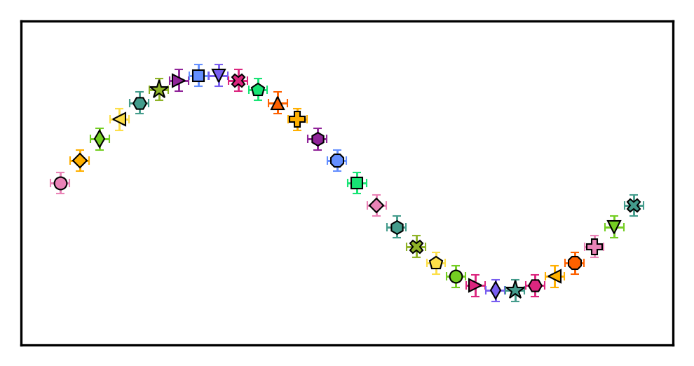
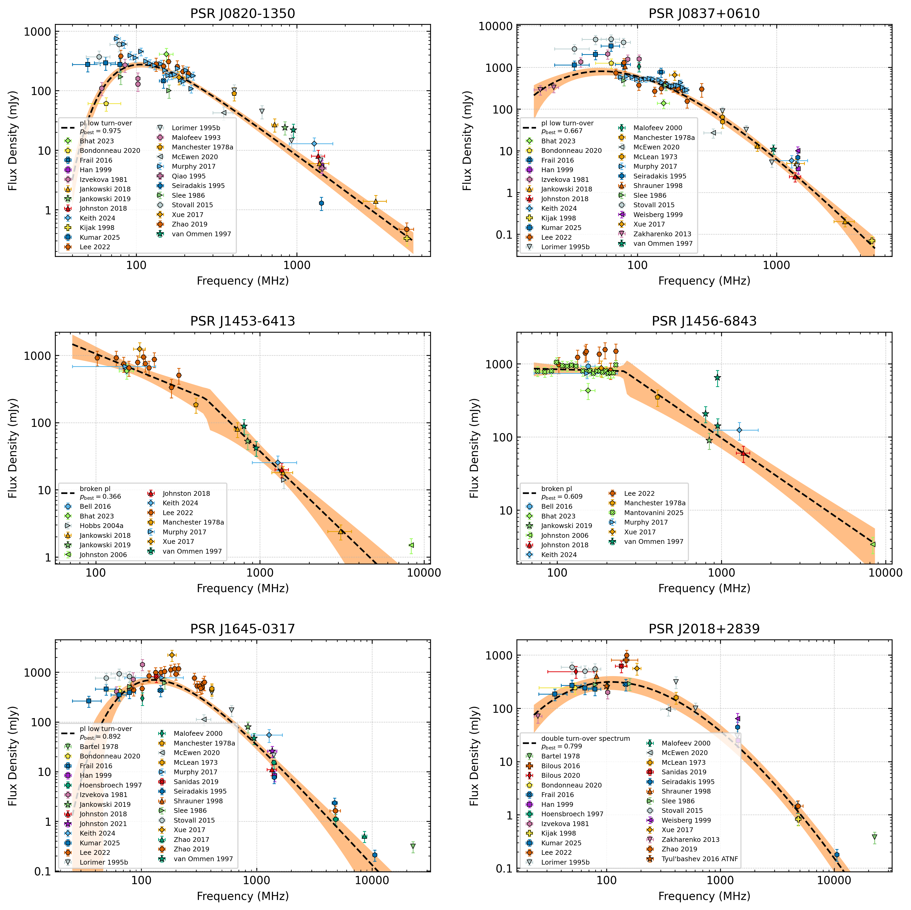

Plotting
========

Below we describe additional features available for customising spectral plots.

Creating publication-quality plots
----------------------------------

The style and verbosity of the spectrum plots can be customised in various ways depending on your
needs. For example, to produce a plot of publication quality, the legend style can be changed from
the default ``raw`` to either ``typeset`` or ``compact``. Both ``raw`` and ``typeset`` will position
the legend to the right of the bounding box and print the full model name, whilst ``compact`` will
position the legend in the lower left of the bounding box and use an abbreviated model name. The
``typeset`` style will also typeset the parameter names using LaTeX. An example of this feature is
given below:

.. code-block:: python

    from pulsar_spectra.catalogue import collect_catalogue_fluxes
    from pulsar_spectra.spectral_fit import find_best_spectral_fit

    cat_dict = collect_catalogue_fluxes()
    pulsar = "J1909-3744"
    freqs, bands, fluxs, flux_errs, refs = cat_dict[pulsar]

    best_model_name, p_best, fit_results, aic_dict, plot_dicts = find_best_spectral_fit(
        pulsar,
        freqs,
        bands,
        fluxs,
        flux_errs,
        refs,
        plot_best=True,
        legend_style="compact",
    )

This will produce the following plot:

Alternately, using ``legend_style='raw'`` (the default):

And lastly with ``legend_style='typeset'``:

The some of the additional plotting options can be found in the docstring for
:py:meth:`pulsar_spectra.plotting.plot_fit` and can be passed to
:py:meth:`pulsar_spectra.spectral_fit.find_best_spectral_fit` using the
``plot_kwargs`` option.

.. _custom_markers:

Using custom marker types
-------------------------

By default, the code will cycle through a set list of marker types. When creating figures for
multiple pulsars, the default marker assignment can lead to inconsistency in the marker types. This
can be solved by assigning a custom marker to each reference. You can specify custom marker types
using the following code:

.. code-block:: python

    from pulsar_spectra.catalogue import collect_catalogue_fluxes
    from pulsar_spectra.spectral_fit import find_best_spectral_fit

    custom_markers = {
    #   reference           :   (marker colour, marker type, marker size)
        "Jankowski_2018"    :   ("magenta", "h", 5), # orange circle
        "Jankowski_2019"    :   ("cyan", "H", 5)  # green diamond
    }

    cat_dict = collect_catalogue_fluxes()
    pulsar = "J1909-3744"
    freqs, bands, fluxs, flux_errs, refs = cat_dict[pulsar]

    best_model_name, p_best, fit_results, aic_dict, plot_dicts = find_best_spectral_fit(
        pulsar,
        freqs,
        bands,
        fluxs,
        flux_errs,
        refs,
        plot_best=True,
        legend_style="typeset",
        plot_kwargs={"ref_markers": custom_markers},
    )

This will produce the following plot:

To generate a set of unique markers for any set of pulsars, see
:ref:`Generating a consistent marker set for a multi-pulsar plot <consistent_markers>`.

Plotting a secondary model
--------------------------

Sometimes you may want to plot more than one best-fit model on the same figure with different
subsets of data included in the fit. To differentiate between the two models, we have included an
alternate model style which is light grey and does not show the uncertainty envelope. For example,
the following code can be used to show the model fit before and after the addition of your data:

.. code-block:: python

    import matplotlib.pyplot as plt
    from pulsar_spectra.catalogue import collect_catalogue_fluxes
    from pulsar_spectra.spectral_fit import find_best_spectral_fit

    cat_dict = collect_catalogue_fluxes()
    pulsar = "J1909-3744"
    freqs, bands, fluxs, flux_errs, refs = cat_dict[pulsar]

    fig, ax = plt.subplots(figsize=(5,4))
    find_best_spectral_fit(
        pulsar,
        freqs,
        bands,
        fluxs,
        flux_errs,
        refs,
        plot_best=True,
        legend_style="typeset",
        plot_kwargs={"axis": ax, "secondary_fit": True},
    )

    freqs = [150.] + freqs
    bands = [30.] + bands
    fluxs = [6.] + fluxs
    flux_errs = [3.] + flux_errs
    refs = ["Your Work"] + refs

    best_model_name, p_best, fit_results, aic_dict, plot_dicts = find_best_spectral_fit(
        pulsar,
        freqs,
        bands,
        fluxs,
        flux_errs,
        refs,
        plot_best=True,
        legend_style="typeset",
        plot_kwargs={"axis": ax},
    )

    ax.set_ylim(top=20.)

    fig.savefig(pulsar+"_"+best_model_name+"_fit.png", bbox_inches="tight", dpi=300)

This will produce the following plot:

Creating a custom plotting configuration
----------------------------------------

The figure, marker, and model styles are specified in the ``pulsar_spectra/configs/plotting_config.yaml``
file. Customisation of the plotting configuration is made easy with the ``build-plotting-config``
command. Information about all available customisations can be found in the help menu:

.. code-block::

    build-plotting-config -h

The default configuration is created by omitting all command line inputs, which will write to a file
called `plotting_config.yaml` in the current directory. If you customise the configuration and want
to make it the new default, you can replace the default ``pulsar_spectra/configs/plotting_config.yaml``
and then reinstall the package (see :ref:`the installation guide <for_developers>`). If you would
like to use a non-default configuration in your script, you can include it by giving the file path
to ``plotting_config`` in ``find_best_spectral_fit()`` like so:

.. code-block:: python

    from pulsar_spectra.catalogue import collect_catalogue_fluxes
    from pulsar_spectra.spectral_fit import find_best_spectral_fit

    cat_dict = collect_catalogue_fluxes()
    pulsar = "J0953+0755"
    freqs, bands, fluxs, flux_errs, refs = cat_dict[pulsar]

    best_model_name, p_best, fit_results, aic_dict, plot_dicts = find_best_spectral_fit(
        pulsar,
        freqs,
        bands,
        fluxs,
        flux_errs,
        refs,
        plot_best=True,
        legend_style="typeset",
        plot_kwargs={"plotting_config": "custom_plotting_config.yaml"},
    )

In the following example, we want to make the following customisations:

- Increase the figure width to 5 inches (keeping the default aspect ratio) (``--fig_height 5``)

- Change the line style of the primary model to a solid line (``--primary_ls -``)

- Change the colour of the model and model error regions to cyan (``--model_colour c --model_error_colour c``)

- Generate a set of unique and randomised markers with the `IBM colour palette <https://davidmathlogic.com/colorblind/>`_ (``--generate_markers --shuffle --palette IBM``)

- Save the file as `custom_plotting_config.yaml` (``-F custom_plotting_config.yaml``)

This can be done with the command:

.. code-block::

    build-plotting-config \
    --fig_height 5 \
    --primary_ls - \
    --model_colour c \
    --model_error_colour c \
    --generate_markers \
    --shuffle \
    --palette IBM \
    -F custom_plotting_config.yaml

The result is the following plot

By default, the ``--generate_markers`` (or ``-g``) option will create a set of
30 unique markers, which will be ordered based on the order of the colour palette
and marker type lists (currently hard-coded in ``build_plotting_config.py``).
You can use the ``--num_markers`` option to increase the size of the unique marker set,
and the ``--shuffle`` option to shuffle the order of markers and colours.

`Note: the shuffle option is not completely random. All of the marker types
will be used before a marker type is reused, and the same is true for the marker colours.`

If you would like to save the generated marker set, you can use the ``--marker_file_savename``
option to specify a file to write to. This can then be imported with the ``--marker_file`` option.
You can preview the generated marker set using ``--marker_preview``,
producing `marker_preview.png`:

.. _consistent_markers:

Generating a consistent marker set for a multi-pulsar plot
----------------------------------------------------------

As discussed :ref:`above <custom_markers>`, you may want to
use a consistent set of markers when showing spectral plots :ref:`side by side <multi_plot>`.
This is made easy with the ``build_plotting_config.py`` script. To generate a
consistent marker set for a set of pulsars, use the ``--pulsars`` (or ``-p``) option.
For example:

.. code-block::

    build-plotting-config \
    --primary_ls - \
    --model_colour c \
    --model_error_colour c \
    --generate_markers \
    --shuffle \
    --palette WONG \
    -F custom_plotting_config.yaml \
    -p J0820-1350 J0837+0610 J1453-6413 J1456-6843 J1645-0317 J2018+2839

In addition to `custom_plotting_config.yaml`, this will also generate `ref_markers.yaml`,
You can then import them in a multi-pulsar plot like so:

.. code-block:: python

    import yaml
    import matplotlib.pyplot as plt
    from pulsar_spectra.spectral_fit import find_best_spectral_fit
    from pulsar_spectra.catalogue import collect_catalogue_fluxes

    with open("ref_markers.yaml", "r") as f:
        ref_markers = yaml.safe_load(f)

    pulsars = [
        "J0820-1350",
        "J0837+0610",
        "J1453-6413",
        "J1456-6843",
        "J1645-0317",
        "J2018+2839"
    ]

    cols = 2
    rows = 3
    fig, axs = plt.subplots(nrows=rows, ncols=cols, figsize=(6*cols, 4*rows))

    cat_dict = collect_catalogue_fluxes()
    for ax_i, pulsar in enumerate(pulsars):
        freqs, bands, fluxs, flux_errs, refs = cat_dict[pulsar]
        find_best_spectral_fit(
            pulsar,
            freqs,
            bands,
            fluxs,
            flux_errs,
            refs,
            plot_best=True,
            legend_style="compact",
            plot_kwargs={"axis": axs[ax_i//cols, ax_i%cols], "ref_markers": ref_markers},
        )
        axs[ax_i//cols, ax_i%cols].set_title("PSR "+pulsar)

    fig.tight_layout(pad=2.5)
    fig.savefig("multi_pulsar_spectra.png", bbox_inches="tight", dpi=300)

This will produce `multi_pulsar_spectra.png` with consistent marker types:

If you add your own data as shown :ref:`here <multi_plot>`, then you can add a custom marker
for your own data by adding a new entry to the ``ref_markers`` dictionary. For example:

.. code-block:: python

    ref_markers["Your Work"] = ["green", "o", 7]