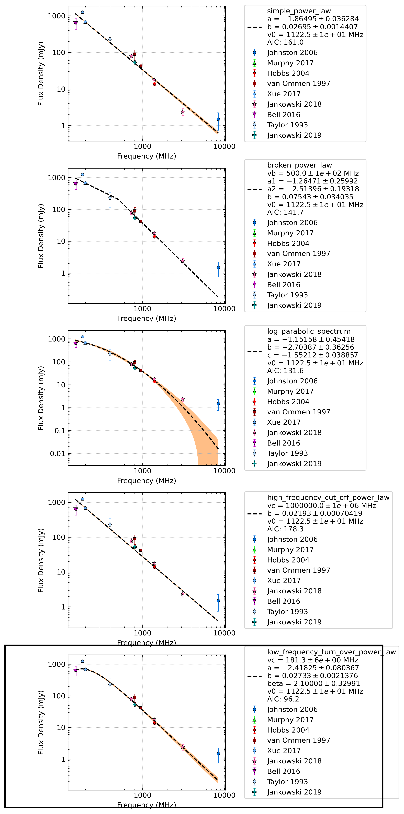

Spectral fit
============

The pulsar spectral fitting is explained in Swainston et al. 2022 and based on `Jankowski et al. 2018 <https://ui.adsabs.harvard.edu/abs/2018MNRAS.473.4436J/abstract>`_.
We will summarise how the fitting is done and examples of how to improve your fits.

Fitting algorithm
-----------------
To account for underestimated uncertainties on outlier points, we modify the regular least-squared quadratic loss function
to deviate to linear loss once a certain distance is reached from the model.
In this way, outlier data are penalised, and bad data is less likely to skew the model fit. We use the Huber loss function, which is defined as

.. math::

    \rho =
    \begin{cases}
    \frac{1}{2}t^2 & \mathrm{if}\:|t|<k \\
    k|t|-\frac{1}{2}k^2 & \mathrm{if}\:|t|\geq k
    \end{cases},

where :math:`t` is a residual and :math:`k` is a constant (which we set to 1.345) that defines the point at which outlying points are penalised.

The code will use `mingrad <https://iminuit.readthedocs.io/en/stable/reference.html#iminuit.Minuit.migrad>`_
function from the `iminuit <https://github.com/iminuit/iminuit>`_
Python package is used to find the minimum of the cost function.
This uses a maximum of 10000 calls to converge with the *Estimated Distance to Minimum* (EDM) criterion.
We set the `tolerance <https://iminuit.readthedocs.io/en/stable/reference.html#iminuit.Minuit.tol>`_
so that the EDM must be less than :math:`10^{-8} * \\mathrm{errordef}`.

In the rare cases that *migrad* does not find a valid fit, we then try the `simplex <https://iminuit.readthedocs.io/en/stable/reference.html#iminuit.Minuit.simplex>`_
and `scan <https://iminuit.readthedocs.io/en/stable/reference.html#iminuit.Minuit.scan>`_ minimisation methods.
*Simplex* does not use derivatives, making it slower but can perform better in some instances.
*Scan* is a brute-force minimisation that uses a grid of possible solutions based on the limits of the input parameters.

The uncertainties were computed using *hesse*, an error calculator which computes the covariance matrix for the fitted parameters and determines
the :math:`1\sigma` uncertainties as the square root of the diagonal elements.
This is all done within the :py:meth:`pulsar_spectra.spectral_fit.iminuit_fit_spectral_model` function.

Models
------
This fit is done for all functions in :ref:`the models module<modelsmodule>` that are included in :py:meth:`pulsar_spectra.models.model_settings`.
For example, at the time of writing this documentation, the list of models within model settings includes:

.. code-block:: python

    model_dict = {
        # Name: [model_function, short_name, start_params, mod_limits]
        "simple_power_law" : [
            simple_power_law,
            "simple pl",
            # (a, c)
            (a_s, c_s),
            [(a_min, a_max), (c_min, c_max)],
        ],
        "broken_power_law" : [
            broken_power_law,
            "broken pl",
            #(vb, a1, a2, c)
            (1e9, a_s, a_s, c_s),
            [(50e6, 5e9), (a_min, a_max), (a_min, a_max), (c_min, c_max)],
        ],
        "log_parabolic_spectrum" : [
            log_parabolic_spectrum,
            "lps",
            #(a, b, c)
            (-1, -1., c_s),
            [(-5, 2), (-5, 2), (None, c_max)],
        ],
        "high_frequency_cut_off_power_law" : [
            high_frequency_cut_off_power_law,
            "pl hard cut-off",
            #(vc, a, c)
            (vc_s, a_s, c_s),
            [vc_both, (a_min, 0.), (c_min, c_max)],
        ],
        "low_frequency_turn_over_power_law" : [
            low_frequency_turn_over_power_law,
            "pl low turn-over",
            #(vpeak, a, c, beta)
            (vpeak_s, a_s, c_s, beta_s),
            [(vpeak_min, vpeak_max), (a_min, 0.), (c_min, c_max) , (beta_min, beta_max)],
        ],
    }

Each item in the dictionary is one of the models that the fitting code will use to fit the pulsar's spectra.
Each item includes a list of the model function, a short name (for plotting), the starting value for each parameter, and the fit limits for each parameter.
You can change some of the starting parameters of fit limits if you think it will improve the fit or even comment out a model you do not want to use, like so:

.. code-block:: python

    model_dict = {
        # Name: [model_function, short_name, start_params, mod_limits]
        "simple_power_law" : [
            simple_power_law,
            "simple pl",
            # (a, c)
            (a_s, c_s),
            [(a_min, a_max), (c_min, c_max)],
        ],
        "broken_power_law" : [
            broken_power_law,
            "broken pl",
            #(vb, a1, a2, c)
            (1e9, a_s, a_s, c_s),
            [(50e6, 5e9), (a_min, a_max), (a_min, a_max), (c_min, c_max)],
        ],
        # "log_parabolic_spectrum" : [
        #     log_parabolic_spectrum,
        #     "lps",
        #     #(a, b, c)
        #     (-1, -1., c_s),
        #     [(-5, 2), (-5, 2), (None, c_max)],
        # ],
        "high_frequency_cut_off_power_law" : [
            high_frequency_cut_off_power_law,
            "pl hard cut-off",
            #(vc, a, c)
            (vc_s, a_s, c_s),
            [vc_both, (a_min, 0.), (c_min, c_max)],
        ],
        "low_frequency_turn_over_power_law" : [
            low_frequency_turn_over_power_law,
            "pl low turn-over",
            #(vpeak, a, c, beta)
            (vpeak_s, a_s, c_s, beta_s),
            [(vpeak_min, vpeak_max), (a_min, 0.), (c_min, c_max) , (beta_min, beta_max)],
        ],
    }

So now, once you reinstall the software, the code will not fit a log parabolic model.

Adding a new model
^^^^^^^^^^^^^^^^^^
If you would like to use a new model, you can add a function to the models' module and set up the defaults for its
initial fit parameters and limits in :py:meth:`pulsar_spectra.models.model_settings`.

For example, here is the function for the simple power law in :ref:`the models module<modelsmodule>`:

.. code-block:: python

    def simple_power_law(v, a, c, v0):
        """Simple power law:

        .. math::
            S_v =  c \\left( \\frac{v}{v_0} \\right)^a

        Parameters
        ----------
        v : `list`
            Frequency in Hz.
        a : `float`
            Spectral Index.
        c : `float`
            Constant.
        v0 : `float`
            Reference frequency.

        Returns
        -------
        S_v : `list`
            The flux density predicted by the model.
        """
        return c*(v/v0)**a

This is the format you must follow to add your model.
Frequency must be the first argument, reference frequency must be the last, and we recommend you make a docstring as shown in the above example.

As explained in the previous section, you must add your new model to :py:meth:`pulsar_spectra.models.model_settings`.
Here are the values for the simple power law:

.. code-block:: python

    # fit starting value, min and max
    # constant
    c_s = 1.
    c_min = 0.
    c_max = None
    # spectral index
    a_s = -1.6
    a_min = -8.
    a_max = 3.

    model_dict = {
        # Name: [model_function, short_name, start_params, mod_limits]
        "simple_power_law" : [
            simple_power_law,
            "simple pl",
            # (a, c)
            (a_s, c_s),
            [(a_min, a_max), (c_min, c_max)],
        ],

Because some of the models have comment parameters (such as spectral index), some of the fit values have been predefined to be consistent between models.

Make sure you reinstall pulsar_spectra to apply any changes you have made to :py:meth:`pulsar_spectra.models.model_settings`, then you will be ready to fit with your new model.

Best fit
--------
The best fit model is determined using the Akaike information criterion (AIC), which measures how much information the model
retains about the data without overfitting. It was implemented as

.. math::

    \mathrm{AIC}=2\beta_\mathrm{min} + 2K + \frac{2K(K+1)}{N-K-1},

where :math:`\beta_\mathrm{min}` is the minimised robust cost function, :math:`K` is the number of free parameters, and :math:`N`
is the number of data points in the fit. The last term is the correction for finite sample sizes, which goes to zero as the sample
size gets sufficiently large. The model which results in the lowest AIC is the most likely to be the best fitting model.

All of this is done by calling the :py:meth:`pulsar_spectra.spectral_fit.find_best_spectral_fit` function like so:

.. code-block:: python

    from pulsar_spectra.catalogue import collect_catalogue_fluxes
    from pulsar_spectra.spectral_fit import find_best_spectral_fit

    cat_dict = collect_catalogue_fluxes()
    pulsar = 'J1453-6413'
    freqs, fluxs, flux_errs, refs = cat_dict[pulsar]
    best_model_name, iminuit_result, fit_info, p_best, p_category = find_best_spectral_fit(pulsar, freqs, fluxs, flux_errs, refs, plot_best=True)

To confirm that the best model has been found, you can visually inspect the fits of all models using the *plot_compare* option like so

.. script location: example_scripts/plot_compare.py
.. code-block:: python

    best_model_name, iminuit_result, fit_info, p_best, p_category = find_best_spectral_fit(pulsar, freqs, fluxs, flux_errs, refs, plot_compare=True)

which will produce

From this plot, it does look like the power-law with a low-frequency turnover is the best model as the code predicted.
If this is not the case and wanted to try and improve the broken power-law fit, for example, you can have more control over the
fit using :py:meth:`pulsar_spectra.spectral_fit.iminuit_fit_spectral_model` function like so.

.. script location: example_scripts/broken_power_law_fit.py
.. code-block:: python

    from pulsar_spectra.catalogue import collect_catalogue_fluxes
    from pulsar_spectra.spectral_fit import iminuit_fit_spectral_model

    cat_list = collect_catalogue_fluxes()
    pulsar = 'J1453-6413'
    freqs, fluxs, flux_errs, refs = cat_list[pulsar]

    # Broken power law function is in the format
    # broken_power_law(v, vb, a1, a2, b, v0)

    # start params for (v, vb, a1, a2, b)
    start_params = (5e8, -1.6, -1.6, 0.1)

    # Fit param limits (min, max) or (v, vb, a1, a2, b)
    mod_limits = [(None, None), (-10, 10), (-10, 0), (0, None)]
    # None means there is no limit

    aic, iminuit_result, fit_info = iminuit_fit_spectral_model(
        freqs,
        fluxs,
        flux_errs,
        refs,
        model_name="broken_power_law",
        start_params=start_params,
        mod_limits=mod_limits,
        plot=True,
        save_name="J1453-6413_broken_power_law.png",
    )

In this example we are manually handing :py:meth:`pulsar_spectra.spectral_fit.iminuit_fit_spectral_model` the default
*start_params* and *mod_limits* but you can edit these.