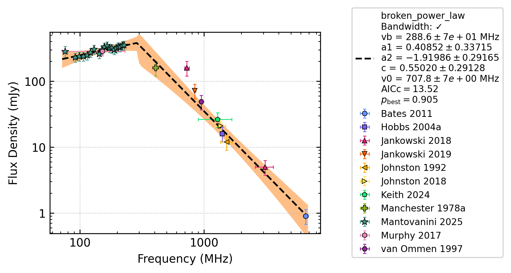
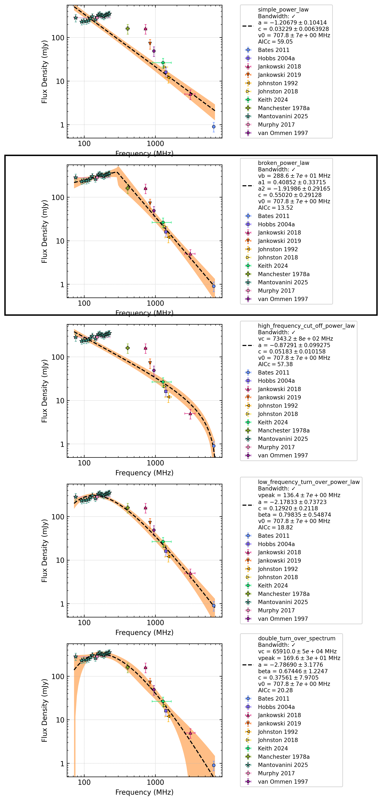
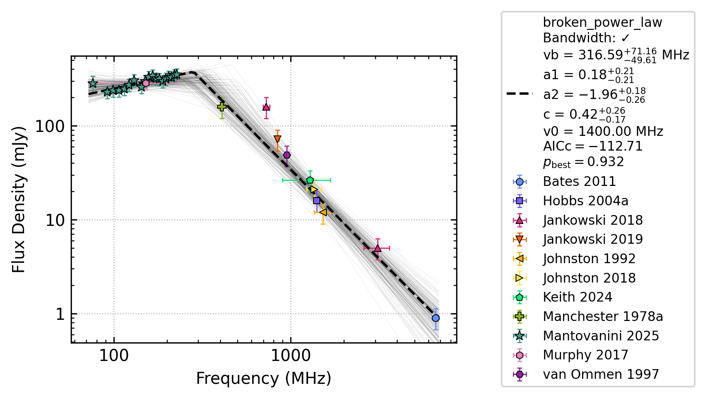
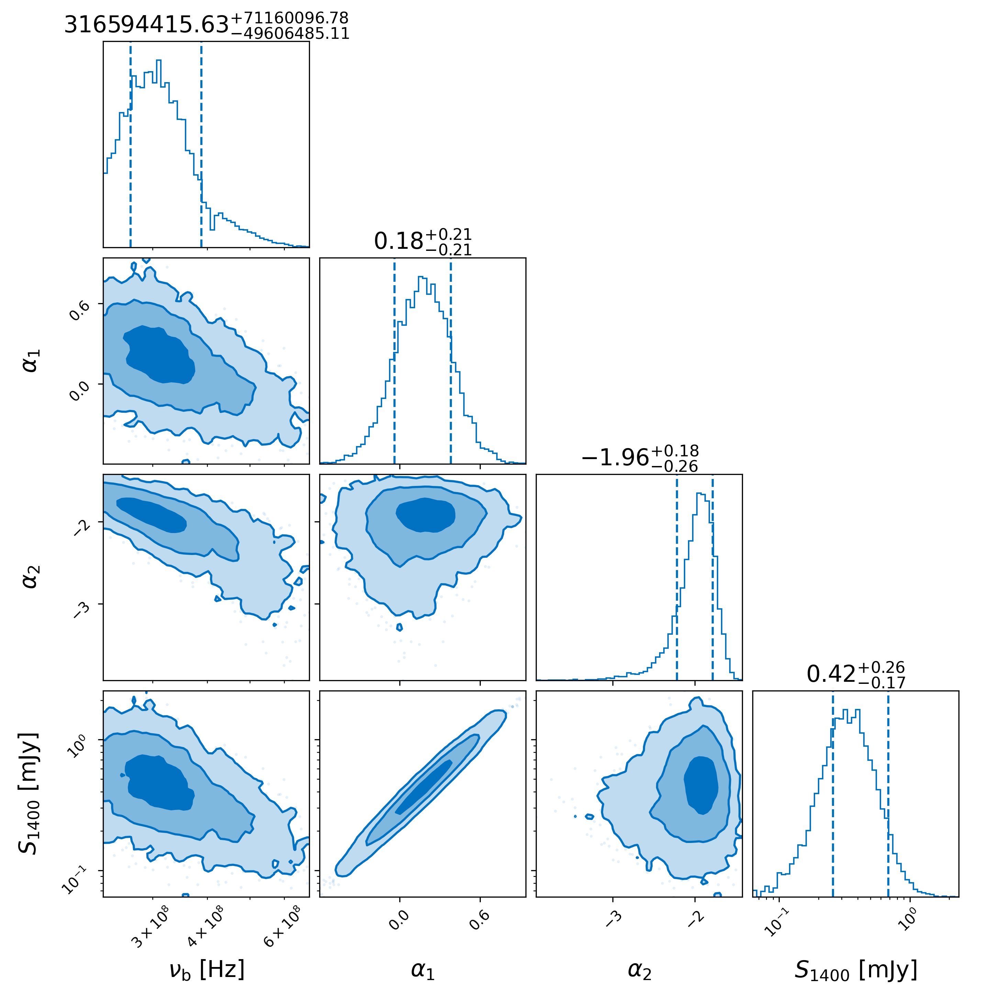

.. _spectralfit:

Spectral fitting
================

The spectral fitting methods implemented in ``pulsar_spectra`` were originally based on the robust
fitting strategy developed by `Jankowski et al. (2018) <https://ui.adsabs.harvard.edu/abs/2018MNRAS.473.4436J/abstract>`_,
but have since evolved to include several new features including bandwidth integration, upper/lower
limits, and different likelihoods. We have also implemented a Bayesian approach to model fitting
which uses empirically-informed priors. These methods are described below, but further details can
be found in `Swainston et al. (2022) <https://ui.adsabs.harvard.edu/abs/2022PASA...39...56S/abstract>`_
and Swainston et al. (in preparation).

.. _fitting-methods:

Fitting methods
---------------

To fit the spectral models to the data, we perform linear regression using one of the two methods
currently implemented:

    1. :ref:`maximum-likelihood-estimation` using the Migrad and Simplex minimisation algorithms
    implemented in the ``iminuit`` model fitting library.

    2. :ref:`bayesian-nested-sampling` using the ``Bilby`` Bayesian inference library and the
    ``Dynesty`` dynamic nested sampler.

Maximum-likelihood estimation is extremely fast and usually produces reliable model fits, however
the error estimation is limited and the minimiser can sometimes converge on a local minimum in the
parameter space which results in a poor fit to the data. Comparatively, Bayesian nested sampling is
more computationally intensive but explores the full parameter space and produces a posterior
probability distribution which can be used to interpret the fit results. This makes it better suited
for complex or poorly-constrained spectra. Futher details on each of the methods are provided below.

.. _maximum-likelihood-estimation:

Maximum-likelihood estimation
^^^^^^^^^^^^^^^^^^^^^^^^^^^^^

This approach is similar to least-squares fitting, but allows us to define custom likelihoods for
robust handling of outliers. For a likelihood :math:`L`, we define the *cost function* as
:math:`\beta = -\log L`. We then use the `Migrad <https://scikit-hep.org/iminuit/reference.html#iminuit.Minuit.migrad>`_
minimisation algorithm from `iminuit <https://scikit-hep.org/iminuit/index.html>`_ to minimise :math:`\beta`
subject to the constraints placed on the free model parameters. The minimiser uses the *Estimated
Distance to Minimum* (EDM) as the convergence criterion, for which we set the
`tolerance <https://scikit-hep.org/iminuit/reference.html#iminuit.Minuit.tol>`_ to :math:`10^{-5}`.
We set the maximum number of calls to :math:`10^4` before the fit is abandoned.

In the rare cases that ``Migrad`` does not find a valid fit, we run the
`Simplex <https://scikit-hep.org/iminuit/reference.html#iminuit.Minuit.simplex>`_ minimiser before
``Migrad``, which is slower but can perform better in some instances. If both minimisers fail, then
we run the brute-force `Scan <https://scikit-hep.org/iminuit/reference.html#iminuit.Minuit.scan>`_
minimiser before ``Migrad``. The hypercube grid that the scan is performed over is bounded by the
parameter limits specified in the ``pulsar_spectra`` source code.

The uncertainties are then estimated using `Hesse <https://scikit-hep.org/iminuit/reference.html#iminuit.Minuit.hesse>`_,
an error calculator which computes the Hessian matrix for the fitted parameters and determines
the :math:`1\sigma` uncertainties as the square root of the diagonal elements.

For implementation details, see :py:meth:`pulsar_spectra.fitters.frequentist.iminuit_fit_spectral_model`
and :py:meth:`pulsar_spectra.fitters.frequentist.migrad_simplex_scan`.

.. _bayesian-nested-sampling:

Bayesian nested sampling
^^^^^^^^^^^^^^^^^^^^^^^^

In the frequentist methods such as :ref:`maximum-likelihood-estimation`, the goal is to maximise the
probability of the data :math:`\mathbf{D}` given the model :math:`M` and a set of parameters
:math:`\mathbf{\Theta}`, i.e. :math:`P(\mathbf{D}|\mathbf{\Theta}, M)`. However, in a scientific
context, we are often looking for the *inverse probability*, or the probability of a set of
parameters given the data and model, :math:`P(\mathbf{\Theta}|\mathbf{D}, M)`. The process of
inverting the probability follows Bayes' Rule:

.. math::
    
    P(\mathbf{\Theta}|\mathbf{D}, M) = \frac{P(\mathbf{D}|\mathbf{\Theta}, M)P(\mathbf{\Theta}|M)}{P(\mathbf{D}|M)}

where :math:`P(\mathbf{D}|\mathbf{\Theta}, M)` is the *likelihood*, :math:`P(\mathbf{\Theta}|M)` is
the *prior probability*, :math:`P(\mathbf{D}|M)` is the *evidence*, and :math:`P(\mathbf{\Theta}|\mathbf{D}, M)`
is the *posterior probability*.

Nested sampling is an approach to Bayesian inference that allows for simultaneous estimation of the
posterior and the evidence. It has many advantages, including being good at sampling multi-model
parameter distributions and being easily parallelisable. It is therefore a logical option for
fitting pulsar spectra, which are often poorly constrained. For more details on nested sampling and
the specific implementation in `Dynesty <https://dynesty.readthedocs.io/en/v3.0.0/index.html>`_,
we recommend reading the `Dynesty documentation <https://dynesty.readthedocs.io/en/v3.0.0/overview.html>`_.

Since the spectral models that we are fitting are empirical, we cannot derive the model parameter
priors from theory. Instead, we use population statistics and the results of past spectral fits
using traditional frequentist fitting methods. For the spectral index and the frequencies of
spectral features (turnover, break, cutoff), we estimate the prior from the distributions reported
in Chapter 6 of `Swainston et al. (2023) <https://espace.curtin.edu.au/handle/20.500.11937/93846>`_
and the `all_pulsar_spectra <https://all-pulsar-spectra.readthedocs.io/en/latest/>`_ repository.
We also fix the reference frequency to :math:`1400\,\mathrm{MHz}` and use the distribution of
:math:`S_{1400}` measurements from the ATNF pulsar catalogue to set the prior on the reference flux
density. Lastly, for the smoothness of the spectral turnover, we use a uniform distribution between
0.1 and 2.1, where 2.1 represents the special case of free-free absorpsion.

.. _likelihoods:

Likelihoods
-----------

.. _gaussian-likelihood:

Gaussian distribution
^^^^^^^^^^^^^^^^^^^^^
The combined Gaussian likelihood, :math:`L_\mathrm{G}`, of :math:`N` measurements :math:`\{x_i, y_i\pm\sigma_{y,i}\}`, where
:math:`i=1\dots N`, is:

.. math::

    L_\mathrm{G} = \prod_i^N \frac{1}{\sqrt{2\pi}\sigma_{y,i}} 
    \exp \left[ - \frac{1}{2} \left( \frac{M(x_i,\mathbf{\Theta})-y_i}{\sigma_{y,i}} \right)^2 \right].

The cost function for the Gaussian likelihood follows a :math:`\chi^2` distribution:

.. math::

    \beta \equiv \chi^2 = -\log L_\mathrm{G} = 
    \sum_i^N \frac{1}{2} \left( \frac{M(x_i,\mathbf{\Theta})-y_i}{\sigma_{y,i}}  \right)^2 + C,

where the constant :math:`C` can be neglected for the purposes of finding the best-fit model. 
For this likelihood, minimising :math:`\beta` is equivalent to weighted least-squares fitting.

.. _huber-likelihood:

Gaussian distribution with Huber loss
^^^^^^^^^^^^^^^^^^^^^^^^^^^^^^^^^^^^^
The Huber loss function is a robust regression technique in which data that deviate by a set
distance from the model are penalised. Following `Jankowski et al. (2018) <https://ui.adsabs.harvard.edu/abs/2018MNRAS.473.4436J/abstract>`_,
we define a *robust cost function* which uses squared-error loss below a distance threshold and
linear loss above it:

.. math::

    \beta = -\log L_\mathrm{H} = \sum_i^N
    \begin{cases}
    \frac{1}{2} R_i^2         & \mathrm{if} |R_i| < k \\
    k |R_i| - \frac{1}{2} k^2 & \mathrm{if} |R_i| \geq k
    \end{cases}

where :math:`L_\mathrm{H}` is a Gaussian likelihood with Huber loss,
:math:`R_i=\left[M(x_i, \mathbf{\Theta}) - y_i\right]/\sigma_{y,i}` are the residuals and :math:`k=1.345`
is the distance threshold. By penalising outliers, data with unaccounted systematic errors will have
less weight in the fit. This technique will be most effective when there is enough good data points
to delineate which of the data are outliers.

.. _t-likelihood:

:math:`t` distribution
^^^^^^^^^^^^^^^^^^^^^^
The :math:`t` distribution is a generalisation of the Gaussian distribution with heavier tails. The
likelihood is:

.. math::

    L_t = \prod_i^N
    \frac{\Gamma \left( \frac{\nu+1}{2} \right)}{\Gamma\left(\frac{\nu}{2}\right) \sqrt{\pi\nu} \sigma_{y,i}}
    \left[1 + \frac{1}{\nu} \left( \frac{M(x_i,\mathbf{\Theta})-y_i}{\sigma_{y,i}}  \right)^2 \right]^{-(\nu+1)/2},

where :math:`\Gamma` is the gamma function and :math:`\nu` is a parameter which controls how much
probability mass is in the tails (the number of 'degrees of freedom' of the distribution). To get
the cost function,

.. math::

    \beta = - \log L_t,

we make use of the ``scipy.stats.t.logpdf`` function in ``SciPy``. Using the :math:`t` distribution,
it is straight-forward to include upper/lower limits in the fit by constructing a
`Tobit likelihood <https://en.wikipedia.org/wiki/Tobit_model>`_, which uses the CDF rather than the
PDF of the distribution.

.. _model-selection:

Model Selection
---------------
When selecting a best-fit model, it is important define what is meant by the 'best fit'. Since we
are primarily comparing empirical models (i.e. models that are not derived from physical theory), it
does not make sense to try to find the 'most probably correct' model using Bayesian statistics, as
there is no clear way to choose sensible priors. Instead, we choose the model which is the best
*predictor* of the data out of the models being compared. To do this, we use the *Akaike Information
Criterion* (AIC) modified for small sample sizes:

.. math::

    \mathrm{AICc} = 2 \beta_\mathrm{min} + 2K + \frac{2K(K+1)}{N - K - 1},

where :math:`\beta_\mathrm{min}` is the minimised cost function, :math:`K` is the number of free
model parameters, and :math:`N` is the number of measurements. This is a technique from information
theory, and the AICc can be thought of as a second-order estimate of the amount of information
lost by a model relative to the other models being tested. As such, the AICc itself is arbitrary
until it is compared between models. When comparing models, a lower AICc is better.

Another factor to consider when selecting a model using the AICc is the sensitivity of the model
selection. When interpreting the model fit, it is useful to know the probability that the selected
best-fit model is truely the best-fit model out of those tested, :math:`p_\mathrm{best}`. To do
this, we calculate the *Akaike weight*, i.e. the relative likelihood of a model :math:`i` compared
with the model with the lowest AICc (:math:`\mathrm{AICc}_\mathrm{min}`):

.. math::

    l_i = \exp \left( -\frac{1}{2} \left| \mathrm{AICc}_i - \mathrm{AICc}_\mathrm{min} \right| \right).

We can then calculate :math:`p_\mathrm{best}`:

.. math::

    p_\mathrm{best} = \left( \sum_i^T \right)^{-1},

where :math:`T` is the number of models being tested. This probability is included in the legend
of each ``pulsar_spectra`` plot to assist with interpreting the fit.

Models
------
This fit is done for all functions in the :ref:`models module<models_module>` that are included in :py:meth:`pulsar_spectra.models.model_settings`.
For example, at the time of writing this documentation, the list of models within model settings includes:

.. code-block:: python

    model_dict = {
        # Name: [model_function, short_name, start_params, mod_limits]
        "simple_power_law" : [
            simple_power_law,
            "simple pl",
            # (a, c)
            (a_s, c_s),
            [(a_min, a_max), (c_min, c_max)],
            simple_power_law_integrate,
        ],
        "broken_power_law" : [
            broken_power_law,
            "broken pl",
            #(vb, a1, a2, c)
            (1e9, a_s, a_s, c_s),
            [(50e6, 5e9), (a_min, a_max), (a_min, a_max), (c_min, c_max)],
            broken_power_law_intergral,
        ],
        "high_frequency_cut_off_power_law" : [
            high_frequency_cut_off_power_law,
            "pl hard cut-off",
            #(vc, a, c)
            (vc_s, a_s, c_s),
            [vc_both, (a_min, 0.), (c_min, c_max)],
            high_frequency_cut_off_power_law_taylor,
        ],
        "low_frequency_turn_over_power_law" : [
            low_frequency_turn_over_power_law,
            "pl low turn-over",
            #(vpeak, a, c, beta)
            (vpeak_s, a_s, c_s, beta_s),
            [(vpeak_min, vpeak_max), (a_min, 0.), (c_min, c_max) , (beta_min, beta_max)],
            low_frequency_turn_over_power_law_taylor,
        ],
        "double_turn_over_spectrum" : [
            double_turn_over_spectrum,
            "double turn over spectrum",
            #(vc, vpeak, a, beta, c)
            (vc_s, vpeak_s, a_s, beta_s, c_s),
            [(vc_both), (vpeak_min, vpeak_max), (a_min, 0.), (beta_min, beta_max), (c_min, c_max)],
            double_turn_over_spectrum_taylor,
        ],
    }

Each item in the dictionary is one of the models that the fitting code will use to fit the pulsar's spectra.
Each item includes a list of the model function, a short name (for plotting), the starting value for each parameter, and the fit limits for each parameter.
You can change some of the starting parameters of fit limits if you think it will improve the fit or even comment out a model you do not want to use, like so:

.. code-block:: python

    model_dict = {
        # Name: [model_function, short_name, start_params, mod_limits]
        "simple_power_law" : [
            simple_power_law,
            "simple pl",
            # (a, c)
            (a_s, c_s),
            [(a_min, a_max), (c_min, c_max)],
            simple_power_law_integrate,
        ],
        "broken_power_law" : [
            broken_power_law,
            "broken pl",
            #(vb, a1, a2, c)
            (1e9, a_s, a_s, c_s),
            [(50e6, 5e9), (a_min, a_max), (a_min, a_max), (c_min, c_max)],
            broken_power_law_intergral,
        ],
        "high_frequency_cut_off_power_law" : [
            high_frequency_cut_off_power_law,
            "pl hard cut-off",
            #(vc, a, c)
            (vc_s, a_s, c_s),
            [vc_both, (a_min, 0.), (c_min, c_max)],
            high_frequency_cut_off_power_law_taylor,
        ],
        "low_frequency_turn_over_power_law" : [
            low_frequency_turn_over_power_law,
            "pl low turn-over",
            #(vpeak, a, c, beta)
            (vpeak_s, a_s, c_s, beta_s),
            [(vpeak_min, vpeak_max), (a_min, 0.), (c_min, c_max) , (beta_min, beta_max)],
            low_frequency_turn_over_power_law_taylor,
        ],
        # "double_turn_over_spectrum" : [
        #     double_turn_over_spectrum,
        #     "double turn over spectrum",
        #     #(vc, vpeak, a, beta, c)
        #     (vc_s, vpeak_s, a_s, beta_s, c_s),
        #     [(vc_both), (vpeak_min, vpeak_max), (a_min, 0.), (beta_min, beta_max), (c_min, c_max)],
        #     double_turn_over_spectrum_taylor,
        # ],
    }

So now, once you reinstall the software, the code will not fit a double turn over spectrum model.

Checking which models you are using
^^^^^^^^^^^^^^^^^^^^^^^^^^^^^^^^^^^
If you are unsure which models or :ref:`derivations <derivations>` you are using in your fitting,
you can use the following function option to print the models info like so:

.. code-block:: python

    from pulsar_spectra.models import model_settings
    model_settings(print_models=True)

Which will output something like this:

.. code-block:: bash

    simple_power_law
        model_function:           simple_power_law
        model_function_integrate: simple_power_law_integrate
        short_name:               simple pl
        start_params:             (-1.6, 1.0)
        mod_limits:               [(-8.0, 3.0), (0.0, None)]

    broken_power_law
        model_function:           broken_power_law
        model_function_integrate: broken_power_law_intergral
        short_name:               broken pl
        start_params:             (1000000000.0, -1.6, -1.6, 1.0)
        mod_limits:               [(50000000.0, 5000000000.0), (-8.0, 3.0), (-8.0, 3.0), (0.0, None)]

    high_frequency_cut_off_power_law
        model_function:           high_frequency_cut_off_power_law
        model_function_integrate: high_frequency_cut_off_power_law_taylor
        short_name:               pl hard cut-off
        start_params:             (4000000000.0, -1.6, 1.0)
        mod_limits:               [None, (-8.0, 0.0), (0.0, None)]

    low_frequency_turn_over_power_law
        model_function:           low_frequency_turn_over_power_law
        model_function_integrate: low_frequency_turn_over_power_law_taylor
        short_name:               pl low turn-over
        start_params:             (100000000.0, -1.6, 1.0, 1.0)
        mod_limits:               [(10000000.0, 2000000000.0), (-8.0, 0.0), (0.0, None), (0.1, 2.1)]

    double_turn_over_spectrum
        model_function:           double_turn_over_spectrum
        model_function_integrate: double_turn_over_spectrum_taylor
        short_name:               double turn over spectrum
        start_params:             (4000000000.0, 100000000.0, -1.6, 1.0, 1.0)
        mod_limits:               [None, (10000000.0, 2000000000.0), (-8.0, 0.0), (0.1, 2.1), (0.0, None)]

You can find the descriptions of the models in the :ref:`models module<models_module>`.

Adding a new model
^^^^^^^^^^^^^^^^^^
If you would like to use a new model, you can add a function to the models' module and set up the defaults for its
initial fit parameters and limits in :py:meth:`pulsar_spectra.models.model_settings`.

For example, here is the function for the simple power law in the :ref:`models module<models_module>`:

.. code-block:: python

    def simple_power_law(v, a, c, v0):
        """Simple power law:

        .. math::
            S_v =  c \\left( \\frac{v}{v_0} \\right)^a

        Parameters
        ----------
        v : `list`
            Frequency in Hz.
        a : `float`
            Spectral Index.
        c : `float`
            Constant.
        v0 : `float`
            Reference frequency.

        Returns
        -------
        S_v : `list`
            The flux density predicted by the model.
        """
        return c*(v/v0)**a

This is the format you must follow to add your model.
Frequency must be the first argument, reference frequency must be the last, and we recommend you make a docstring as shown in the above example.

As explained in the previous section, you must add your new model to :py:meth:`pulsar_spectra.models.model_settings`.
Here are the values for the simple power law:

.. code-block:: python

    # fit starting value, min and max
    # constant
    c_s = 1.
    c_min = 0.
    c_max = None
    # spectral index
    a_s = -1.6
    a_min = -8.
    a_max = 3.

    model_dict = {
        # Name: [model_function, short_name, start_params, mod_limits]
        "simple_power_law" : [
            simple_power_law,
            "simple pl",
            # (a, c)
            (a_s, c_s),
            [(a_min, a_max), (c_min, c_max)],
        ],

Because some of the models have common parameters (such as spectral index), some of the fit values have been predefined to be consistent between models.

Make sure you reinstall pulsar_spectra to apply any changes you have made to :py:meth:`pulsar_spectra.models.model_settings`, then you will be ready to fit with your new model.

Finding the best-fit model
--------------------------
To find the best-fit model out of those implemented in ``pulsar_spectra``, you can use the
:py:meth:`pulsar_spectra.spectral_fit.find_best_spectral_fit` function. As a simple example:

.. code-block:: python

    from pulsar_spectra.catalogue import collect_catalogue_fluxes
    from pulsar_spectra.spectral_fit import find_best_spectral_fit

    cat_dict = collect_catalogue_fluxes()
    pulsar = 'J1327-6222'
    freqs, bands, fluxs, flux_errs, refs = cat_dict[pulsar]

    best_model_name, p_best, fit_results, aic_dict, plot_dicts = find_best_spectral_fit(
        pulsar,
        freqs,
        bands,
        fluxs,
        flux_errs,
        refs,
        plot_best=True,
    )

The parameters returned are: the name of the best-fit model, the :math:`p_\mathrm{best}` of the
best-fit model, a dictionary of ``iminuit`` or ``Bilby`` results objects, a dictionary of AICc
values, and a dictionary of data and metadata used to plot the model fits. Here, we have specified
``plot_best=True``, which will create a plot of the data showing the best-fit spectral model:

If you would instead like to visually compare all of the models that were tested, then you can
use the option ``plot_compare=True``. This will produce the following comparison plot:

By default, :ref:`maximum-likelihood-estimation` and the :ref:`huber-likelihood` likelihood will be
used. The fitting method and likelihood can be specified with the ``method`` and ``likelihood``
options. For example:

.. code-block:: python

    best_model_name, p_best, fit_results, aic_dict, plot_dicts = find_best_spectral_fit(
        pulsar,
        freqs,
        bands,
        fluxs,
        flux_errs,
        refs,
        plot_best=True,
        method="bayesian-nested-sampling",
        likelihood="t",
    )

This will produce the following plot, which shows 100 samples from the posterior distribution of the
best-fit model (grey lines), as well as the sample with the maximum likelihood (black dashed line).
The legend provides the median posterior estimate and the 16% to 84% credible interval for each
parameter.

The plots generated by ``Bilby`` and ``Dynesty`` will be written to a subdirectory. One of the
diagnostic plots generated is a corner plot showing the posterior probability distribution:

If you would like more control over the model fitting, the functions are contained in the
:ref:`fitters module<fitters_module>`. Documentation for these functions can be found in their
docstrings, and the source code for :py:meth:`pulsar_spectra.spectral_fit.find_best_spectral_fit`
provides an example of their usage.